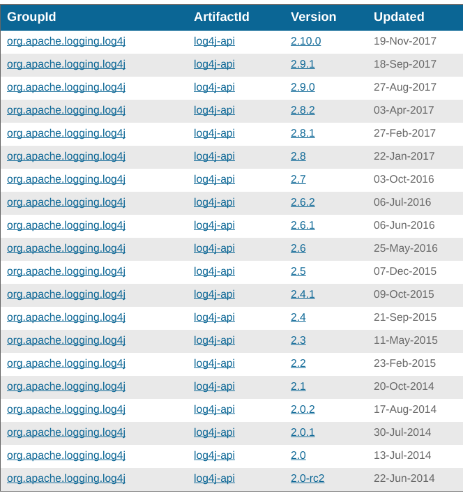
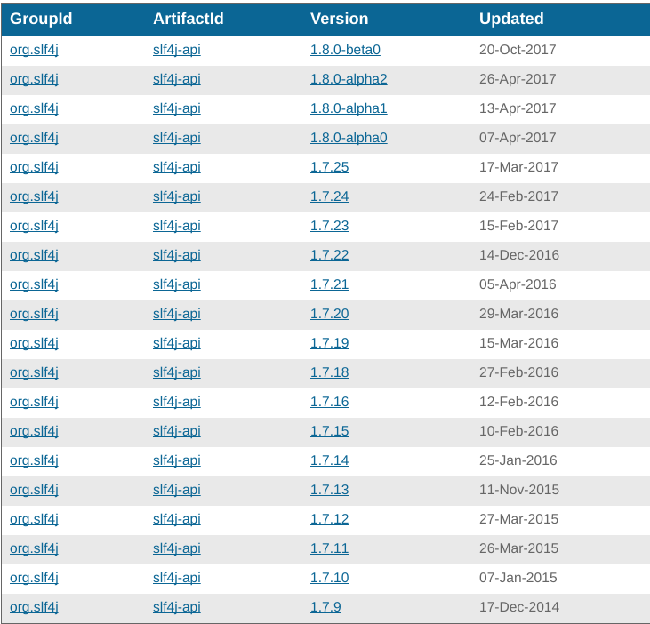

# 如何设计结构化日志系统

1. 系统定位与设计总则
2. 选择一款日志实现库和一款API
3. 设计结构化日志的一些常见技巧
4. 总结

## 1. 系统定位与设计总则

### 1.1. Library与Project

定位一个工程是Library和Project可以根据此工程是否被其他工程依赖，依赖是指maven dependency的方式依赖，不是广义的依赖，
如果被另一个工程依赖，那么此工程可基本确定为Library。 如果不被另一个工程依赖，一般会独立部署到一台服务器上；那么此工程可确定为Project。
针对Library和Project构建的结构化日志系统是不同的。

### 1.2. 总则1: 避免喋喋不休

在\<Classic Shell Scripting\>这本书中，提到过UNIX软件工具的几个设计原则。其中有一条对结构化日志系统的设计有很好的指导意义：  
  
**避免喋喋不休**  
  
\[ 软件工具的执行过程不该像在“聊天”（chatty）。不要将“开始处理”（start processing）,“即将完成”（almost done）
或是“处理完成”（finished processing）这类信息放进程序的标准输出（至少这不该是默认状态）。
若每个工具都将自己的信息送至标准错误输出，那么整个屏幕就会布满一堆无用的过程信息。**在工具程序的世界里，没有消息就是好消息** \]  
  
设计结构化日志系统与UNIX软件工具的设计哲学类似。避免无用的过程日志占据硬盘空间和混淆错误定位是非常必要的。
我们需要记录日志主要是为了排查将来可能遇到的问题与bug，那么设计一个避免冗余的结构化日志系统是非常必要的。

### 1.3. 总则2: 要携带足够的信息

这句总则看上去和第一条总则是矛盾的，并且像一句废话，但我所见满足此条标准的项目并不多；
实际上在有限的日志中携带足够的信息是必要的，因为出问题要从有限的日志信息中挖掘问题的原因。
因此更要精细的设计呈现出的日志格式，使其避免冗余又包含足够的信息（我知道这很难）。

### 1.4. 适用于Library的规则

1. Library中，异常尽量抛出去交给应用层处理不要自己记录错误日志。因为Library自己记录日志的话，有一定概率不能和应用层日志记录方式保持一致。
2. 可以保留一定的info级别的日志，但是最好提供verbose开关，以便用户动态调整，类似于`if (verbose()) logger.info("info")`。
3. 在Library中，不可以依赖日志实现库只可以依赖API，比如不能依赖`log4j-core`以及桥接库`log4j-jcl`等，因为容易在应用层与用户自己的日志实现库冲突。
4. 清楚自己的Library使用的目标用户和使用环境，根据这些条件选择一款合适的API比如流行的`slf4j-api`或者`commons-logging`，选择的标准是尽量和用户其他依赖的Library的API保持一致，
防止一个工程出现多个API。第二个选择标准是API稳定，长期保持一个版本，不会造成依赖多个版本的API的问题（`slf4j-api`更新略频繁，大项目中很容易出现多个版本）。

### 1.5. 适用于Project的规则

1. Project中，要选择一款适用于你们项目或者公司传统的日志实现库，比如你司在`logback`上有一定积累和开发了一定的周边工具，那么不要另类选择`log4j2`。不一致也会带给软件开发一定伤害。
2. 要对异常日志进行包装，如果你们已经非常了解某一类异常产生的原因，可以不用记录异常堆栈，只记录自己包装的error message，更好的让日志满足总则1和2。
实际上日志应该只记录Unexpected Exception的堆栈信息。
3. 对不同的日志分文件显示， 比如访问日志分为（xx-system.access）, 跟踪日志分为(xx-system.trace)，事件日志分为(xx-system.event)，其他日志分为(xx-system.log)。
4. 和Library一样，Project日志对单个功能也要提供可配置的verbose开关，并且这些verbose配置是可推送或可动态配置的。以便追踪一些难以发现的问题。

## 2. 选择一款日志实现库和一款API

### 2.1. 常用日志API和日志实现库

在Java开发中，有一些常见的日志API和日志实现库，相对著名的API库有`commons-logging`，`slf4j-api`以及`log4j-api`。
相对著名的API实现库有`log4j2`以及`logback`。当你选择`slf4j-api`和`logback`组合或者`log4j-api`和`log4j2`组合时，
不需要引入额外的bridge库。否则的话，还需要引入类似于`log4j-jcl`或者`log4j-slf4j-impl`等桥接库。
在一些较新语言的使用者(比如go)看来，Java的日志有诸多的不合理之处, 比如为什么有多套的库来实现日志, 
我们可以深入探讨一下这个历史问题。  
  
历史上Java是没有默认的日志库的，Ceki Gülcü实现了第一版的`log4j`，并在Java开发届变得流行。
在游说jdk团队把`log4j`加入jdk失败后，jdk团队开发了自己的日志实现库`java.util.logging`，
遗憾的是这个自带的日志库并没有获得绝大多数开发的认可，日志实现库在这个时候就走向了分裂。
随后`log4j`也出现了一些问题。Ceki Gülcü转而开发了流行到现在的`slf4j-api`和`logback`，日志的实现库在这个时候更加分裂。
事实上采用`log4j`和`logback`的开源软件日益增多，导致了不可避免的兼容问题。
而apache团队近年来开发的`log4j2`实际上是一款更先进的日志实现库，有优秀的插件系统和更快的性能，但也有自己的API库`log4j-api`,
在未来会一步一步蚕食`logback`的市场份额, 到那时日志实现库和API会更加分裂, 对每个开发者都有影响。
  
这份历史引发了Java开发日志系统的乱象。而`slf4j-api`和`log4j-api`的版本管理更加剧了乱象，原因是由于采用maven的module来管理API和桥接库，即使API没有任何更新也会随着其他库的更新而增加版本。
在一个依赖稍微多一些的Project中，不难发现会依赖多个版本的`slf4j-api`或`log4j-api`; 希望未来`slf4j`团队和`log4j`团队能正视这个问题，将依赖广泛的这两个API独立管理，使版本更稳定便于依赖。 
下图是`slf4j-api` 和 `log4j-api` 版本的更新状况  
  
  
    
在看这篇文章的开发者的你，我只希望不要随便造日志库的轮子，如果不小心你的库流行了之后，虽然会给你个人带来巨大声望，但是在开发届的影响有可能是负面的。试着改善现有的日志系统而不是发明轮子，也是一种贡献。
  

### 2.2. 清楚内部细节

## 3. 设计结构化日志的一些常见技巧

1. 动态日志开关
2. 合理规划日志文件
3. 合理规划日志内容
4. 合理规划日志级别
5. 性能取舍与异步写入

### 3.1. 动态日志开关

### 3.2. 合理规划日志文件

### 3.3. 合理规划日志内容

### 3.4. 合理规划日志级别

### 3.5. 性能取舍与异步写入

## 4. 总结

