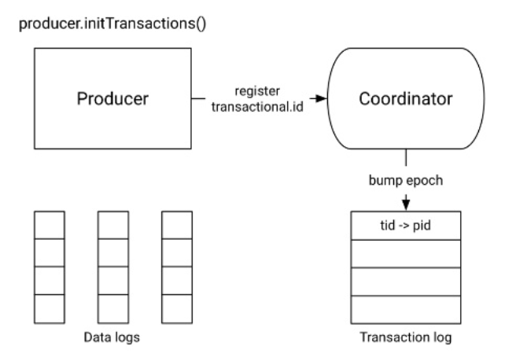
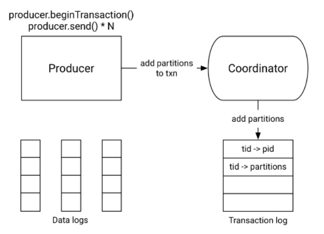
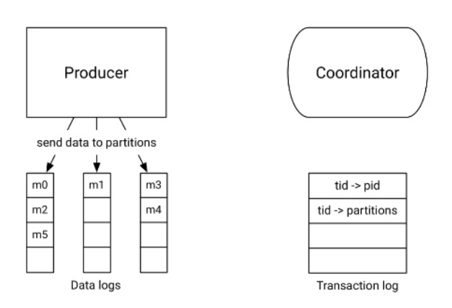
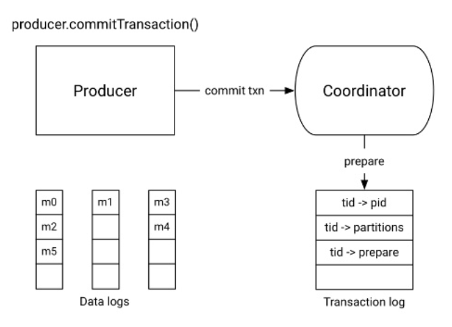
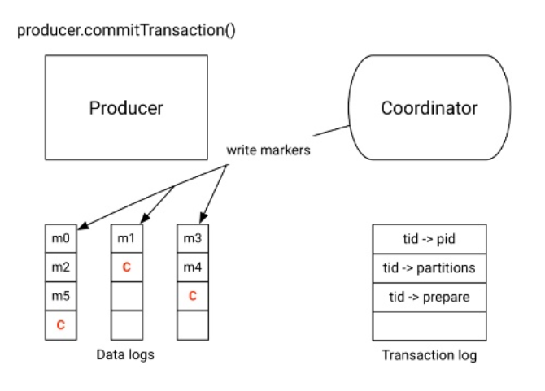
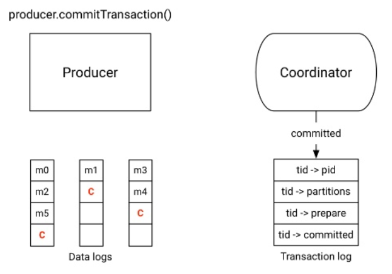
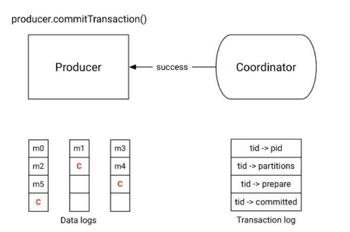

# Kafka

## Getting started

### 简介
Apache Kafka 是 一个分布式流处理平台  

1. 消息队列， 可以发布和订阅消息
2. 消息磁盘持久化， 可以订阅其他消费者已消费的消息
3. Connector组件与Stream组件可以将其他第三方应用集成到Kafka中

### 架构

1. 单broker

```$xslt  

                           +-----------+
                           | Zookeeper |
                           +-----------+      
                                 |
                    +---------------------------+
+--------+  topic1  | +---------------------- + |  1...N   +--------+
|Producer|--------->| |  Topic1 Partition 1   | |--------->|Consumer|
+--------+          | |-----------------------| |          +--------+
                    | |  Topic1 Partition 2   | |
                    | +-----------------------+ |
                    |         broker            |
                    | +---------------------- + |
                    | |  Topic2 Partition 1   | |
+--------+  topic2  | |-----------------------| |  1...N   +--------+
|Producer|--------->| |  Topic2 Partition 2   | |--------->|Consumer|
+--------+          | +-----------------------+ |          +--------+
                    +---------------------------+
                                |
                          +------------+
                          |File System |
                          +------------+
                   
```

2. 多broker cluster

```$xslt  
                        +--------------------+
                        |      Zookeeper     |
                        +--------------------+
                           |              |
                    +---------------------------+
+--------+  topic1  | +--------+     +--------+ |  1...N   +--------+
|Producer|--------->| |        |     |        | |--------->|Consumer|
+--------+          | |        |  C  |        | |          +--------+
                    | |        |  l  |        | |
+--------+  topic2  | |Broker1 |  u  |Broker2 | |  1...N   +--------+
|Producer|--------->| |        |  s  |        | |--------->|Consumer|
+--------+          | |        |  t  |        | |          +--------+
                    | |        |  e  |        | |
+--------+  topic3  | |        |  r  |        | |  1...N   +--------+
|Producer|--------->| |        |     |        | |--------->|Consumer|
+--------+          | +--------+     +--------+ |          +--------+
                    +---------------------------+
                          |                 |
                   +------------+     +------------+
                   |File System |     |File System |
                   +------------+     +------------+
                   
```

### 简单使用

```java  

nohup bin/zookeeper-server-start.sh config/zookeeper.properties & // 启动zookeeper

nohup bin/kafka-server-start.sh config/server.properties & // 启动kafka

bin/kafka-topics.sh --create --zookeeper localhost:2181 --replication-factor 1 --partitions 5 --topic test // 创建topic

bin/kafka-console-producer.sh --broker-list localhost:9092 --topic test // 创建消息
>This is a message
>This is another message

bin/kafka-console-consumer.sh --bootstrap-server localhost:9092 --topic test --from-beginning // 启动Consumer读取消息
This is a message
This is another message

```

### Broker 集群

```java  

cp config/server.properties config/server-1.properties
cp config/server.properties config/server-2.properties

config/server-1.properties:
    broker.id=1
    listeners=PLAINTEXT://your ip:9093
    log.dir=/tmp/kafka-logs-1
 
config/server-2.properties:
    broker.id=2
    listeners=PLAINTEXT://your ip:9094
    log.dir=/tmp/kafka-logs-2

nohup bin/kafka-server-start.sh config/server-1.properties & // 启动broker1
nohup bin/kafka-server-start.sh config/server-2.properties & // 启动broker2

bin/kafka-topics.sh --create --zookeeper localhost:2181 --replication-factor 3 --partitions 5 --topic my-replicated-topic

```

### Partition

1. 结构  


2. Partition 和 replica

在kafka中， 备份是以partition为单位进行的， 即一个partition的备份节点有可能会分布在多个broker上， 多个broker中只有一个broker里有某个partition的header节点。在Producer写入某个topic时，只写入这个topic的partition的header节点。这些header节点分布在不同的broker中，可以最大限度的利用网络。
broker, topic, partition的结构如下  
  
```java  

        1...N         1...N
broker-------->topic--------->partition

```

当一个Topic有多个partition 并且topic创建时设置了`replication-factor` 时， 如下所示  
`> bin/kafka-topics.sh --create --zookeeper localhost:2181 --replication-factor 2 --partitions 10 --topic demo`  
那么我们查看这个topic时会如下所示
```java  

> bin/kafka-topics.sh --describe --zookeeper localhost:2181 --topic demo
Topic:demo      PartitionCount:10       ReplicationFactor:2     Configs:
        Topic: demo     Partition: 0    Leader: 1       Replicas: 1,0   Isr: 1,0
        Topic: demo     Partition: 1    Leader: 2       Replicas: 2,1   Isr: 2,1
        Topic: demo     Partition: 2    Leader: 0       Replicas: 0,2   Isr: 0,2
        Topic: demo     Partition: 3    Leader: 1       Replicas: 1,2   Isr: 1,2
        Topic: demo     Partition: 4    Leader: 2       Replicas: 2,0   Isr: 2,0
        Topic: demo     Partition: 5    Leader: 0       Replicas: 0,1   Isr: 0,1
        Topic: demo     Partition: 6    Leader: 1       Replicas: 1,0   Isr: 1,0
        Topic: demo     Partition: 7    Leader: 2       Replicas: 2,1   Isr: 2,1
        Topic: demo     Partition: 8    Leader: 0       Replicas: 0,2   Isr: 0,2
        Topic: demo     Partition: 9    Leader: 1       Replicas: 1,2   Isr: 1,2
```

* "leader"是负责给定分区所有读写操作的节点。每个节点都是随机选择的部分分区的领导者。
* "replicas"是复制分区日志的节点列表。
* "isr"是一组“同步”replicas（in-sync replicas），是replicas列表的子集。
  
ISR集合中的节点都是和 leader 保持高度一致的，只有这个集合的成员才有资格被选举为 leader，一条消息必须被这个集合所有节点读取并追加到日志中，这条消息才能视为提交。这个ISR集合发生变化会在ZooKeeper持久化，因此这个集合中的任何一个节点都有资格被选为leader。  
  
判断节点Alive  
  
1. 节点必须可以维护和 ZooKeeper 的连接，Zookeeper通过心跳机制检查每个节点的连接。
2. 如果节点是个follower ，它必须能及时的同步leader的写操作，并且延时不能太久。
  
满足以上2个条件的节点的状态为"in sync" 会出现在上文提到的ISR节点中

### Consumer Group

Consumer Group是Kafka实现单播和广播两种消息模型的手段。同一个topic的数据，会广播给不同的consumer group；同一个group中的consumer，只有一个consumer能拿到这个数据。换句话说，对于同一个topic，每个consumer group都可以拿到同样的所有数据，但是数据进入group后只能被其中的一个consumer消费。consumer group内的consumer可以使用多线程或多进程来实现，也可以将进程分散在多台机器上，consumer的数量通常不超过partition的数量，因为Kafka在设计时假定了一个partition只能被一个consumer消费。那么我们可以制作出如下的消费消息示意图

```java  
                                                             1...50
                                                        +------------+ 
                                 1...100         |------| Consumer 1 |
                           +-----------------+   |      +------------+
                  |--------| Consumer Group1 |---|          51...100
   1...100        |        +-----------------+   |      +------------+
+----------+      |                              |------| Consumer 2 |
| Messages |------|                                     +------------+
+----------+      |              1...100                   
                  |        +-----------------+               1...100
                  |--------| Consumer Group2 |---|      +------------+
                           +-----------------+   |------| Consumer 1 |
                                                        +------------+
```

### 示例代码

1. 依赖
```xml  

<dependency>
    <groupId>org.apache.kafka</groupId>
    <artifactId>kafka-clients</artifactId>
    <version>1.0.0</version>
</dependency>

```

2. Producer

```java  

Properties props = new Properties();
props.put(ProducerConfig.BOOTSTRAP_SERVERS_CONFIG, "192.168.100.125:9092");
props.put(ProducerConfig.CLIENT_ID_CONFIG, "demo_producer");
props.put(ProducerConfig.KEY_SERIALIZER_CLASS_CONFIG, "org.apache.kafka.common.serialization.IntegerSerializer");
props.put(ProducerConfig.VALUE_SERIALIZER_CLASS_CONFIG, "org.apache.kafka.common.serialization.StringSerializer");
try (Producer<Integer, String> producer = new KafkaProducer<>(props)) {
    for (int i = 0; i < 1000; i++) {
        producer.send(new ProducerRecord<>("demo", i, "value" + i)).get();
    }
}

```

3. Consumer

```java  

Properties props = new Properties();
props.put(ConsumerConfig.BOOTSTRAP_SERVERS_CONFIG, "192.168.100.125:9092");
props.put(ConsumerConfig.GROUP_ID_CONFIG, "demo_group");
props.put(ConsumerConfig.ENABLE_AUTO_COMMIT_CONFIG, "true");
props.put(ConsumerConfig.AUTO_COMMIT_INTERVAL_MS_CONFIG, "1000"); // 自动提交offset
props.put(ConsumerConfig.SESSION_TIMEOUT_MS_CONFIG, "30000");
props.put(ConsumerConfig.KEY_DESERIALIZER_CLASS_CONFIG, "org.apache.kafka.common.serialization.IntegerDeserializer");
props.put(ConsumerConfig.VALUE_DESERIALIZER_CLASS_CONFIG, "org.apache.kafka.common.serialization.StringDeserializer");
try (Consumer<Integer, String> consumer = new KafkaConsumer<>(props)) {
    consumer.subscribe(Arrays.asList("demo"));
    while (true) {
        ConsumerRecords<Integer, String> records = consumer.poll(200);
        if (records == null) continue;
        for (ConsumerRecord<Integer, String> record : records) {
            System.out.println("Received message: (" + record.key() + ", " + record.value() + ") at offset " + record.offset());
        }
        // consumer.commitSync(); // 手动同步提交offset
        // consumer.commitAsync(); // 手动异步提交offset
    }
}

```

4. 更精细的控制Producer

实现`Partitioner`接口， 并注册到`KafkaProducer` 可以定制Producer的数据发送到哪些partition。
默认的实现是`DefaultPartitioner`如果这个topic有多个partition， 那么采取轮询的方式写每个partition。

```java  

props.put(ProducerConfig.PARTITIONER_CLASS_CONFIG, "package.your.Partitioner");

```

5. 更精细的控制Consumer

```java  

// consumer.subscribe(Arrays.asList("demo"));
List<PartitionInfo> list = consumer.partitionsFor("demo");
consumer.assign(list.stream().map(e -> new TopicPartition(e.topic(), e.partition())).collect(toList()));
consumer.seekToBeginning(consumer.assignment()); // 从头开始订阅
while (true) {
    ConsumerRecords<Integer, String> records = consumer.poll(200);
    ...
}

```

## Deep dive into kafka

### 日志系统的结构与实现

我们选取一台broker 1查看一下kafka的日志， 这里的日志指的是partition的持久化数据

```java  

leon@DESKTOP-RSTF5V3:/tmp/kafka-logs-1$ ls
__consumer_offsets-11  __consumer_offsets-20  __consumer_offsets-32  __consumer_offsets-44  cleaner-offset-checkpoint  demo-5  log-start-offset-checkpoint
__consumer_offsets-14  __consumer_offsets-23  __consumer_offsets-35  __consumer_offsets-47  demo-0                     demo-6  meta.properties
__consumer_offsets-17  __consumer_offsets-26  __consumer_offsets-38  __consumer_offsets-5   demo-1                     demo-7  recovery-point-offset-checkpoint
__consumer_offsets-2   __consumer_offsets-29  __consumer_offsets-41  __consumer_offsets-8   demo-3                     demo-9  replication-offset-checkpoint

```

这里的`__consumer_offsets`是kafka的隐式topic， 记录各个Consumer的提交的offset。 后面的数字后缀表示是第几个partition，我们可以看到`demo`这个topic的0,1,3,5,6,7,9 这些个partition分布在broker1中， 这些partition有些是header, 有些是follower。每个目录下面又以每1GB的大小再进行文件分割。
  
kafka的日志系统的实现也和aeron类似， 采用内存映射文件（memory-mapped file）。由文件系统的pagecache来控制写入， 避免了在jvm内缓存数据再刷新到磁盘的潜在不一致问题。  

在日志系统的实现上，吞吐量（Throughput）也是kafka实现上的一个重要考量，在用内存映射文件解决磁盘性能问题之后， 还要解决网络IO的性能和字节数组的大量拷贝。  
kafka采用了"消息块"大量消息打包一起发送到服务端， 而不是一次只发送一条消息（类似redis的pipeline）。并使用[zero-copy](http://man7.org/linux/man-pages/man2/sendfile.2.html)将数据从 pagecache 转移到 socket 网络连接中。
  
传统的非zero-copy采用如下过程：  
  
1. 操作系统从磁盘读取数据到内核空间的 pagecache
2. 应用程序读取内核空间的数据到用户空间的缓冲区
3. 应用程序将数据(用户空间的缓冲区)写回内核空间到套接字缓冲区(内核空间)
4. 操作系统将数据从套接字缓冲区(内核空间)复制到通过网络发送的 NIC 缓冲区
  
### 日志压缩

可以保留相同key值的最后一条记录， 删除履历  
压缩操作通过在后台周期性的拷贝日志段来完成。 清除操作不会阻塞读取，并且可以被配置不超过一定IO吞吐来避免影响Producer和Consumer


  
日志压缩的配置  

```java  
log.cleanup.policy=compact
log.cleaner.min.compaction.lag.ms // 保证消息在配置的时长内不被压缩, 不配置除了最后一个日志都压缩

// 活动的segment 不压缩
```

### Message delivery semantic

三种delivery语义
1. At most once
2. At least once
3. Exactly once

#### Producer角度看三种语义
在Producer端， 参数acks与retries来实现这三种语义

1. `acks=0` producer不等待服务器的返回， 视为提交成功，并且`retries`参数不生效， 等同于`At most once`语义
2. `acks=1` producer提交到leader并且leader返回结果就视为提交成功， 不等待leader提交到follower的结果。如果提交到leader失败，producer会根据`retries`参数重试，等同于`At least once`
3. `acks=-1` producer等待leader以及leader提交数据到`min.insync.replicas` 个 follower 成功视为提交成功，如果失败的话会根据`retries`参数重试， **这种情况并不等同于`Exactly once`**
  
幂等性Exactly once配置  
  
```java  

acks=-1 
retries > 0(最好MAX_INT)
enable.idempotence=true //幂等性参数， 给producer分配PID和Sequence Number保证不会重复
max.in.flight.requests.per.connection=1 // producer端允许出现未确认请求的最大数量

```

#### Consumer角度看三种语义

1. Consumer读取到消息之后，先进行offset提交，然后再处理消息，如果消息处理到一半失败了，那这条消息就再也不会被消费了，这对应于`At most once`的语义。
2. Consumer读取到消息之后，先处理消息，最后再offset提交。这样如果处理消息成功，在offset提交之前服务崩溃了，那么重启之后这条消息会再次被消费到，这对应于`At least once`的语义。
3. `Exactly once` 存疑

#### Kafka事务消息

```java  
// producer 端
props...
props.put(ProducerConfig.TRANSACTIONAL_ID_CONFIG, "your_transactional.id"); // 指定事务id
try (Producer<Integer, String> producer = new KafkaProducer<>(props)) {
    producer.initTransactions();
    try {
        producer.beginTransaction();
        for (int i = 0; i < 10; i++) {
            producer.send(new ProducerRecord<>("demo", i, "value" + i)).get();
        }
        producer.commitTransaction();
    } catch (KafkaException e) {
        producer.abortTransaction();
    }
}


// consumer 端
props.put(ConsumerConfig.ISOLATION_LEVEL_CONFIG, "read_committed"); // 读已提交
try (Consumer<Integer, String> consumer = new KafkaConsumer<>(props)) {
    ....
}

// 事务隔离级别
read_committed 与 read_uncommitted
```

#### Kafka事务消息原理















### Producer 的重要配置

acks
compression
batch size

### Consumer 的重要配置

fetch size

### Broker 的重要配置

### 容错

### zookeeper元数据

```java  

// broker关机 结点消失
/brokers/ids/[0...N] --> {"jmx_port":...,"timestamp":...,"endpoints":[...],"host":...,"version":...,"port":...} (ephemeral node) 

// topic 注册
/brokers/topics/[topic]/partitions/[0...N]/state --> {"controller_epoch":...,"leader":...,"version":...,"leader_epoch":...,"isr":[...]} (ephemeral node)

// consumer 注册 consumer消失 节点消失
/consumers/[group_id]/ids/[consumer_id] --> {"version":...,"subscription":{...:...},"pattern":...,"timestamp":...} (ephemeral node)

// partition被哪个Consumer消费信息注册 
/consumers/[group_id]/owners/[topic]/[partition_id] --> consumer_node_id (ephemeral node)

// cluster id
/cluster/id
```

### 运维与最佳实践

```java  

// 创建topic
bin/kafka-topics.sh --zookeeper zk_host:port/chroot --create --topic my_topic_name --partitions 20 --replication-factor 3

// 添加分区， 不自动重平衡分区数据
bin/kafka-topics.sh --zookeeper zk_host:port/chroot --alter --topic my_topic_name --partitions 40

// 增加删除配置项
bin/kafka-configs.sh --zookeeper zk_host:port/chroot --entity-type topics --entity-name my_topic_name --alter --add-config x=y
bin/kafka-configs.sh --zookeeper zk_host:port/chroot --entity-type topics --entity-name my_topic_name --alter --delete-config x

// 删除topic 不支持减少分区
bin/kafka-topics.sh --zookeeper zk_host:port/chroot --delete --topic my_topic_name

// 重平衡Leader partition
auto.leader.rebalance.enable=true
leader.imbalance.check.interval.seconds
bin/kafka-preferred-replica-election.sh --zookeeper host:port

// graceful shutdown
非 kill -9 杀死broker进程。 那么会同步日志到磁盘再关闭， 避免了重启时进行日志CRC验证的工作
如果设置了
controlled.shutdown.enable=true
在关闭时还会进行leader 迁移

// 集群间镜像数据
bin/kafka-mirror-maker.sh --consumer.config consumer.properties --producer.config producer.properties --whitelist my-topic
结合auto.create.topics.enable = true 可以创建副本集群

// 查看consumer消费位置
bin/kafka-consumer-groups.sh --bootstrap-server localhost:9092 --describe --group my-group
TOPIC                          PARTITION  CURRENT-OFFSET  LOG-END-OFFSET  LAG        CONSUMER-ID                                       HOST                           CLIENT-ID
my-topic                       0          2               4               2          consumer-1-029af89c-873c-4751-a720-cefd41a669d6   /127.0.0.1                     consumer-1
my-topic                       1          2               3               1          consumer-1-029af89c-873c-4751-a720-cefd41a669d6   /127.0.0.1                     consumer-1
my-topic                       2          2               3               1          consumer-2-42c1abd4-e3b2-425d-a8bb-e1ea49b29bb2   /127.0.0.1                     consumer-2

// 管理consumer 组
bin/kafka-consumer-groups.sh --bootstrap-server localhost:9092 --list
test-consumer-group
bin/kafka-consumer-groups.sh --bootstrap-server localhost:9092 --describe --group test-consumer-group
TOPIC                          PARTITION  CURRENT-OFFSET  LOG-END-OFFSET  LAG        CONSUMER-ID                                       HOST                           CLIENT-ID
test-foo                       0          1               3               2          consumer-1-a5d61779-4d04-4c50-a6d6-fb35d942642d   /127.0.0.1                     consumer-1

```

### 分区重分配

[Expanding your cluster](http://kafka.apache.org/documentation.html#basic_ops_cluster_expansion)
