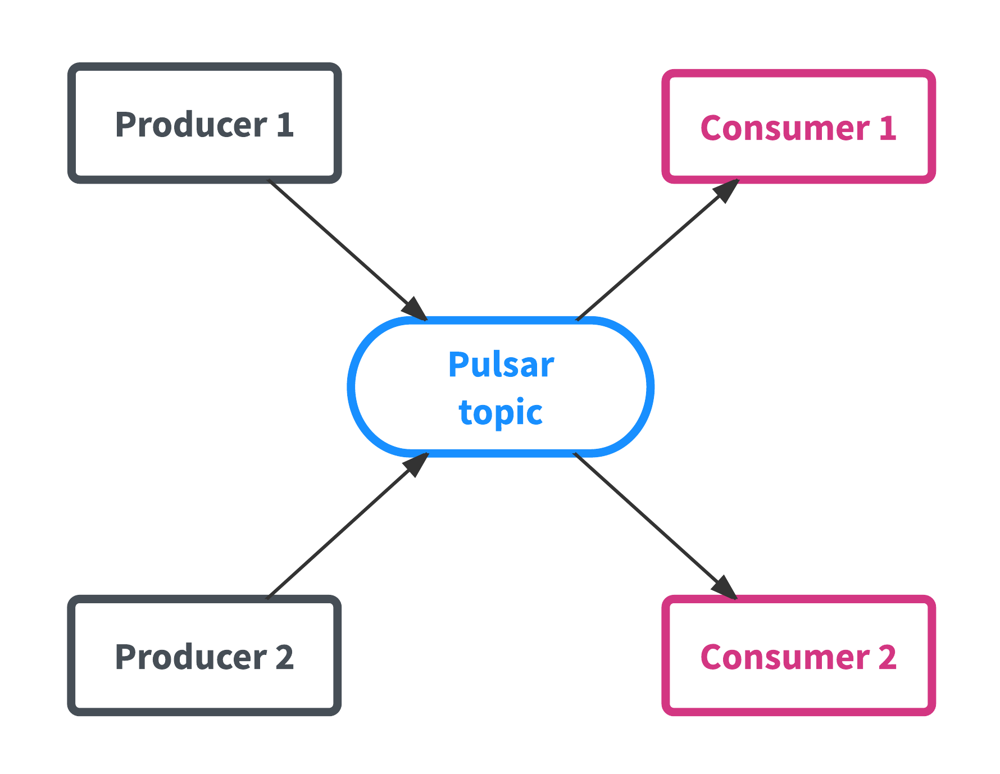
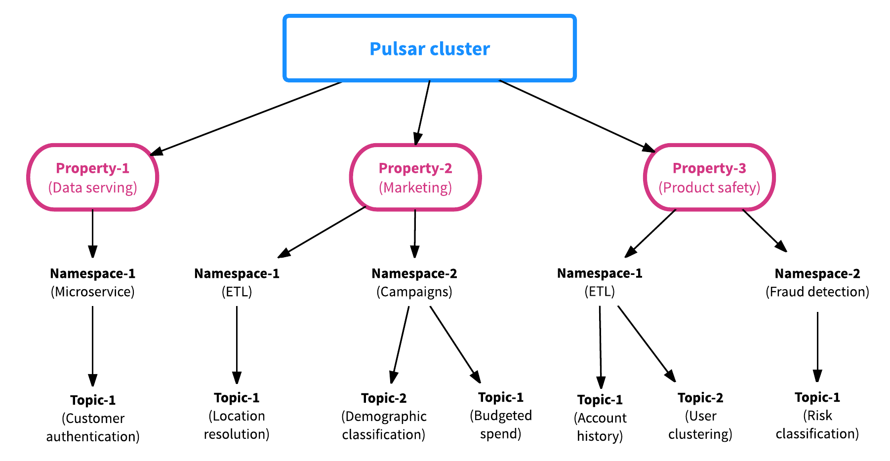
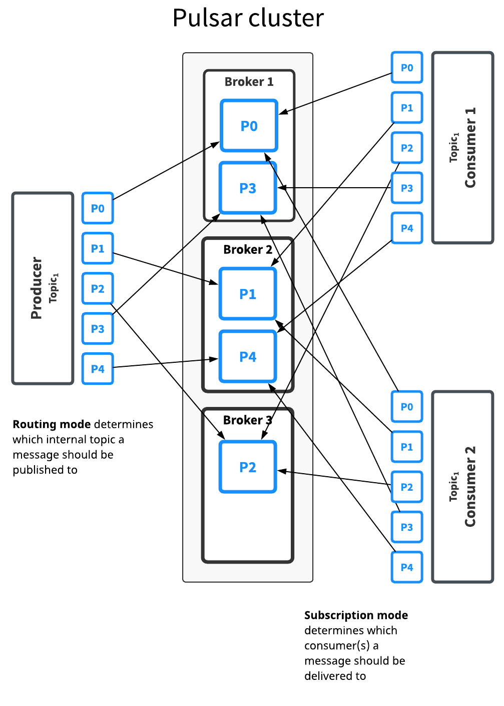
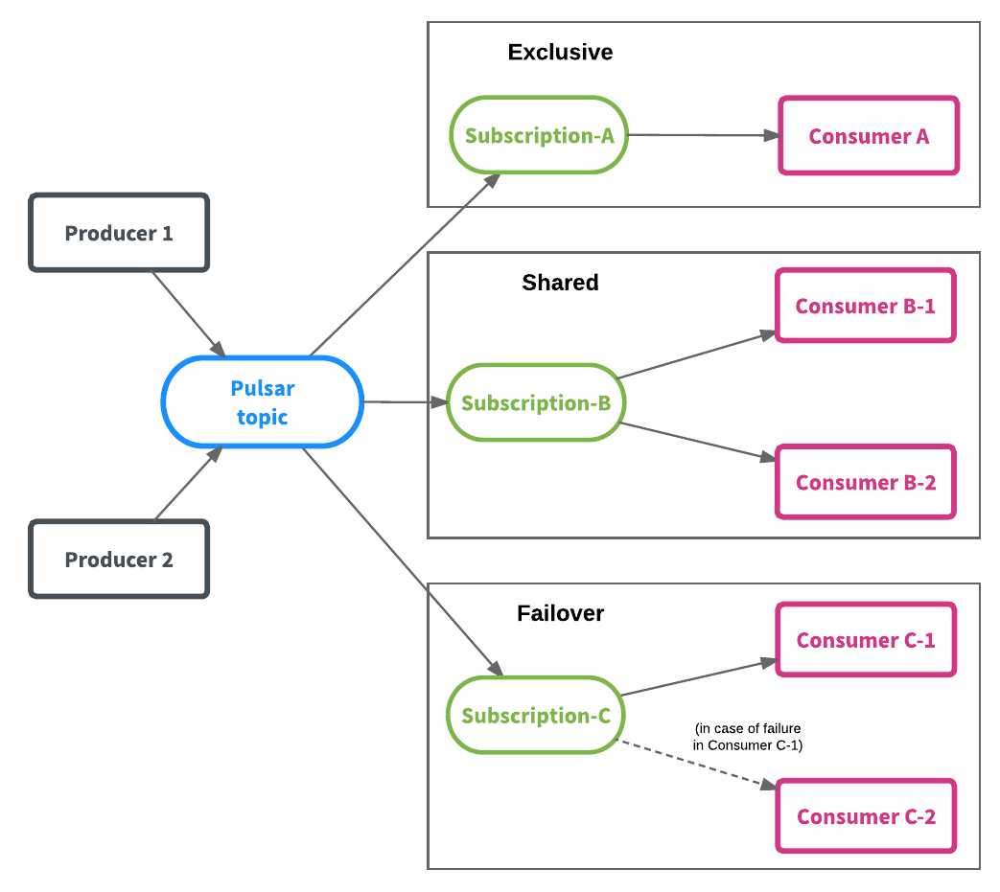
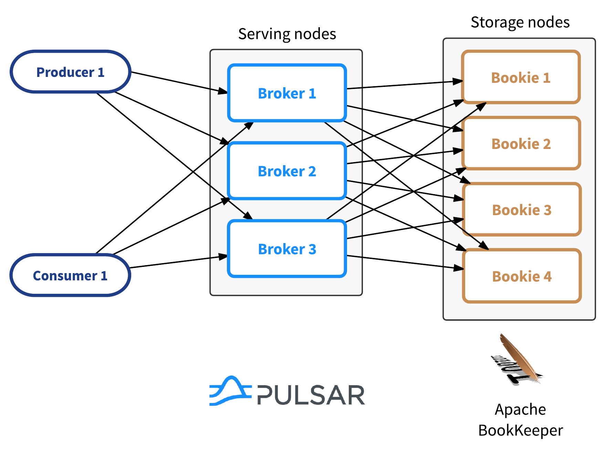

# Pulsar

# 简介

1. Pulsar是pub-sub模式的分布式消息平台，拥有灵活的消息模型和直观的客户端API。
2. Pulsar由雅虎开发并开源的下一代消息系统，目前是Apache软件基金会的项目。
3. 最新版本是2.2.0
  

  
# 架构


# 基本概念

## Topic, Tenant, Namespace, Partition

Topic是Pulsar的核心概念，表示一个`channel`，Producer可以写入数据，Consumer从中消费数据  
Topic名称的url类似如下的结构：  

`{persistent|non-persistent}://tenant/namespace/topic`

* persistent|non-persistent表示数据是否持久化（Pulsar支持消息持久化和非持久化两种模式）
* Tenant为租户
* Namespace一般聚合一系列相关的Topic，一个租户下可以有多个Namespace
* 默认值: 当一个topic不指明url时, 比如topic为`chart`, 那么默认的url为`persistent://public/default/chart`
  
如图所示:  
    

  
上图中Property即为租户，每个租户下可以有多个Namespace，每个Namespace下有多个Topic。  
Namespace是Pulsar中的操作单元，包括Topic是配置在Namespace级别的，包括多地域复制，消息过期策略等都是配置在Namespace上的。  
  
为了解决分区问题Pulsar和kafka类似采取了分区机制  
  

  
Pulsar提供了一些策略来处理消息到Partition的路由（MessageRouter）：  
  
* Single partitioning：Producer随机选择一个Partition并将所有消息写入到这个分区
* Round robin partitioning ：采用Round robin的方式，轮训所有分区进行消息写入
* Hash partitioning：这种模式每条消息有一个Key，Producer根据消息的Key的哈希值进行分区的选择（Key相同的消息可以保证顺序）。
* Custom partitioning：用户自定义路由策略  
  
不同于Kafka，Pulsar允许Consumer的数量超过分区的数量  
在Shared subscription的订阅模式下，Consumer数量可以大于分区的数量，每个Consumer处理每个Partition中的一部分消息，不保证消息的顺序。

## 订阅模型
  
Pulsar提供了灵活的消息模型，支持三种订阅类型：
  
* Exclusive subscription：排他的，只能有一个Consumer，接收一个Topic所有的消息
* Shared subscription：共享的，可以同时存在多个Consumer，每个Consumer处理Topic中一部消息（Shared模型是不保证消息顺序的，Consumer数量可以超过分区的数量）
* Failover subscription：Failover模式，同一时刻只有一个有效的Consumer，其余的Consumer作为备用节点，在Master Consumer不可用后进行替代（看起来适用于数据量小，且解决单点故障的场景）


  
## Broker, Bookie
  

  
Pulsar采用"存储和服务分离"的两层架构（这是Pulsar区别于其他MQ系统最重要的一点，也是所谓的"下一代消息系统"的核心）：  

* Broker：提供发布和订阅的服务（Pulsar的组件）
* Bookie：提供存储能力（BookKeeper的存储组件）
优势是Broker成为了stateless组件，可以水平扩容。高可靠，一致性等通过BookKeeper去保证。  

## Geo-replication
  

  
上图中，Producer P1、P2、P3在不同的Cluster发送给Topic T1的消息，会在Cluster之间进行复制，Consumer C1、C2可以在自己所在的Cluster消费到所有的消息。
当消息被写入Pulsar时，首先消息被持久化在local cluster，之后异步的发送到其他cluster。在没有链接问题的情况下，通常复制的latency相近于网络的RTT。

## Pulsar function, Pulsar IO, Pulsar SQL

### Pulsar function  
  


### Pulsar IO


  
|Name	| Java Class	| 
|-------|---------------|
| Aerospike sink	| org.apache.pulsar.io.aerospike.AerospikeSink |
| Cassandra sink	| org.apache.pulsar.io.cassandra.CassandraSink |
| Kafka source	|org.apache.pulsar.io.kafka.KafkaSource |
| Kafka sink	|org.apache.pulsar.io.kafka.KafkaSink |
| Kinesis sink	|org.apache.pulsar.io.kinesis.KinesisSink |
| RabbitMQ source	|org.apache.pulsar.io.rabbitmq.RabbitMQSource |
| Twitter Firehose source	|org.apache.pulsar.io.twitter.TwitterFireHose |

### Pulsar SQL

```java  
./bin/pulsar standalone
./bin/pulsar sql-worker run
./bin/pulsar sql

presto> select * from pulsar."public/default".topic1;

  firstname  | middlename  |  lastname   |              email               |   username   | password | telephonenumber | age |                 companyemail                  | nationalidentitycardnumber | 
-------------+-------------+-------------+----------------------------------+--------------+----------+-----------------+-----+-----------------------------------------------+----------------------------+
 Genesis     | Katherine   | Wiley       | genesis.wiley@gmail.com          | genesisw     | y9D2dtU3 | 959-197-1860    |  71 | genesis.wiley@interdemconsulting.eu           | 880-58-9247                |   
 Brayden     |             | Stanton     | brayden.stanton@yahoo.com        | braydens     | ZnjmhXik | 220-027-867     |  81 | brayden.stanton@supermemo.eu                  | 604-60-7069                |   
 Benjamin    | Julian      | Velasquez   | benjamin.velasquez@yahoo.com     | benjaminv    | 8Bc7m3eb | 298-377-0062    |  21 | benjamin.velasquez@hostesltd.biz              | 213-32-5882                |   
 Michael     | Thomas      | Donovan     | donovan@mail.com                 | michaeld     | OqBm9MLs | 078-134-4685    |  55 | michael.donovan@memortech.eu                  | 443-30-3442                |   
 Brooklyn    | Avery       | Roach       | brooklynroach@yahoo.com          | broach       | IxtBLafO | 387-786-2998    |  68 | brooklyn.roach@warst.biz                      | 085-88-3973                |   
 Skylar      |             | Bradshaw    | skylarbradshaw@yahoo.com         | skylarb      | p6eC6cKy | 210-872-608     |  96 | skylar.bradshaw@flyhigh.eu                    | 453-46-0334                |    
.
.
.

```

# 细节

### 集群创建

集群环境的最小要求  
6 台 linux 机器或虚拟机  
其中  
3台zookeeper集群  
3台pulsar broker与bookie  
1台service discovery(可选)  

推荐的硬件配置

zookeeper略  
Bookies & Brokers  
高速cpu以及高速网卡(10Gbps), SSD或HDDs  

```java  

# zookeeper集群略
# zk1.example.com:2181,zk2.example.com:2181,zk3.example.com:2181

# pulsar
wget https://archive.apache.org/dist/pulsar/pulsar-2.2.0/apache-pulsar-2.2.0-bin.tar.gz
tar xvzf apache-pulsar-2.2.0-bin.tar.gz
cd apache-pulsar-2.2.0

# 写入集群的metadata到zookeeper
bin/pulsar initialize-cluster-metadata \
  --cluster pulsar-cluster-1 \
  --zookeeper zk1.example.com:2181 \
  --configuration-store zk1.example.com:2181 \
  --web-service-url http://pulsar.example.com:8080 \
  --web-service-url-tls https://pulsar.example.com:8443 \
  --broker-service-url pulsar://pulsar.example.com:6650 \
  --broker-service-url-tls pulsar+ssl://pulsar.example.com:6651

# Bookie cluster
# conf/bookkeeper.conf
# zkServers=zk1.example.com:2181,zk2.example.com:2181,zk3.example.com:2181
bin/pulsar-daemon start bookie

# Broker cluster
# conf/broker.conf
# zookeeperServers=zk1.example.com:2181,zk2.example.com:2181,zk3.example.com:2181
# configurationStoreServers=zk1.example.com:2181,zk2.example.com:2181,zk3.example.com:2181
# clusterName=pulsar-cluster-1
# functionsWorkerEnabled=true(可选)
# pulsarFunctionsCluster=pulsar-cluster-1(可选)
bin/pulsar broker

# Service discovery
# conf/discovery.conf
# zookeeperServers=zk1.example.com:2181,zk2.example.com:2181,zk3.example.com:2181
# configurationStoreServers=zk1.example.com:2181,zk2.example.com:2181,zk3.example.com:2181
bin/pulsar-daemon start discovery

```

### Namespace创建

```java


```
  
### 客户端编程

#### Producer

```java


```

#### Consumer


#### Reader