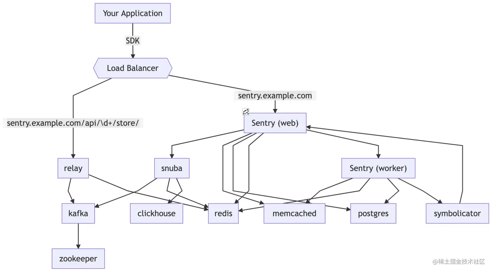
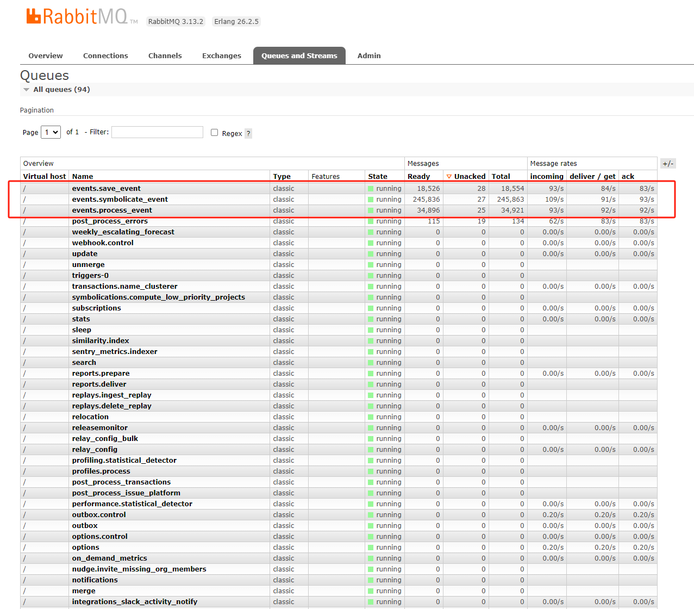
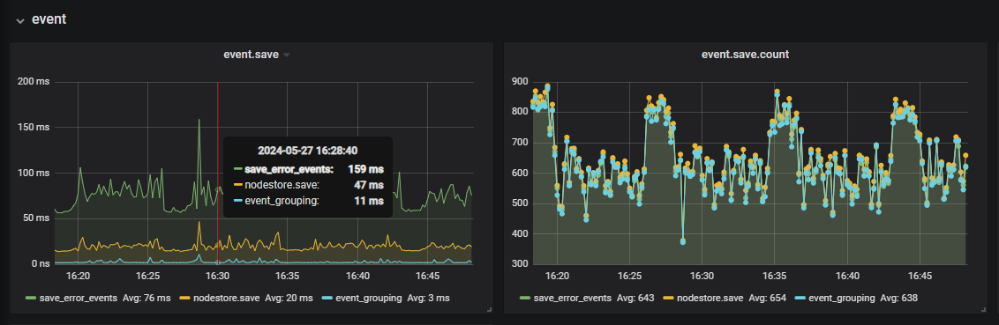
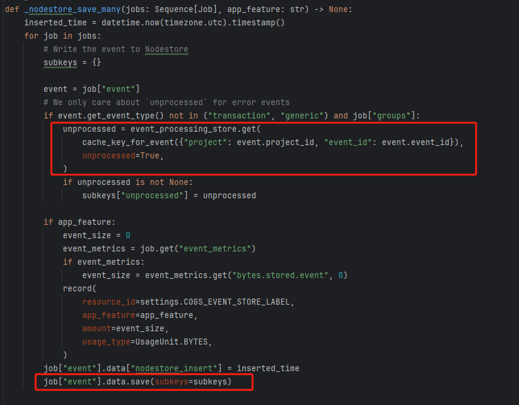

# Sentry

# 1. 安装与启动

```
wget https://github.com/getsentry/self-hosted/archive/refs/tags/24.4.0.tar.gz
tar -xvf 24.4.0.tar.gz
cd ./self-hosted-24.4.0
sudo ./install.sh

docker-compose up -d
```

# 2. 各模块简介

```
sentry-self-hosted-nginx-1

sentry-self-hosted-relay-1
sentry-self-hosted-web-1
sentry-self-hosted-worker-1-1

# kafka相关

sentry-self-hosted-subscription-consumer-events-1
sentry-self-hosted-subscription-consumer-metrics-1
sentry-self-hosted-subscription-consumer-transactions-1
sentry-self-hosted-subscription-consumer-generic-metrics-1
sentry-self-hosted-ingest-monitors-1
sentry-self-hosted-ingest-profiles-1
sentry-self-hosted-ingest-occurrences-1
sentry-self-hosted-ingest-replay-recordings-1
sentry-self-hosted-metrics-consumer-1
sentry-self-hosted-events-consumer-1-1
sentry-self-hosted-transactions-consumer-1
sentry-self-hosted-attachments-consumer-1
sentry-self-hosted-generic-metrics-consumer-1
sentry-self-hosted-billing-metrics-consumer-1

# 事件后处理

sentry-self-hosted-post-process-forwarder-errors-1
sentry-self-hosted-post-process-forwarder-issue-platform-1
sentry-self-hosted-post-process-forwarder-transactions-1

# snuba 相关

sentry-self-hosted-snuba-generic-metrics-distributions-consumer-1
sentry-self-hosted-snuba-group-attributes-consumer-1
sentry-self-hosted-snuba-replays-consumer-1
sentry-self-hosted-snuba-api-1
sentry-self-hosted-snuba-replacer-1
sentry-self-hosted-snuba-issue-occurrence-consumer-1
sentry-self-hosted-snuba-generic-metrics-sets-consumer-1
sentry-self-hosted-snuba-errors-consumer-1
sentry-self-hosted-snuba-metrics-consumer-1
sentry-self-hosted-snuba-outcomes-billing-consumer-1
sentry-self-hosted-snuba-spans-consumer-1
sentry-self-hosted-snuba-transactions-consumer-1
sentry-self-hosted-snuba-subscription-consumer-metrics-1
sentry-self-hosted-snuba-outcomes-consumer-1
sentry-self-hosted-snuba-profiling-profiles-consumer-1
sentry-self-hosted-snuba-profiling-functions-consumer-1
sentry-self-hosted-snuba-generic-metrics-counters-consumer-1
sentry-self-hosted-snuba-subscription-consumer-transactions-1
sentry-self-hosted-snuba-subscription-consumer-events-1

# 存储层

sentry-self-hosted-kafka-1
sentry-self-hosted-postgres-1
sentry-self-hosted-clickhouse-1
sentry-self-hosted-zookeeper-1
sentry-self-hosted-symbolicator-1
sentry-self-hosted-redis-1
sentry-self-hosted-memcached-1
sentry-self-hosted-vroom-1

# 定期清理数据

sentry-self-hosted-cron-1
sentry-self-hosted-symbolicator-cleanup-1
sentry-self-hosted-vroom-cleanup-1
sentry-self-hosted-sentry-cleanup-1

# 其他

sentry-self-hosted-smtp-1
graphite
rabbitmq
```

# 3. 架构以及事件处理流程



[event ingest graph](https://getsentry.github.io/event-ingestion-graph/)

# 4. 监控以及配置调优

### 4.1 relay 配置

配置项位置：`/path/to/self-hosted/relay/config.yml`

* [relay options](https://docs.sentry.io/product/relay/options/)
```yaml
relay:
  mode: "managed" # managed, static, proxy
  upstream: "http://web:9000/"
  host: 0.0.0.0
  port: 3000
logging:
  level: ERROR
processing:
  enabled: true
  kafka_config:
    - {name: "bootstrap.servers", value: "kafka:9092"}
    - {name: "message.max.bytes", value: 50000000} # 50MB
  redis: redis://redis:6379
  geoip_path: "/geoip/GeoLite2-City.mmdb"
cache:
  envelope_buffer_size: 1000000
  project_grace_period: 3600
  project_expiry: 3600
limits:
  max_concurrent_requests: 200
  max_event_size: 1000000 # 1MB
metrics: 
  statsd: "172.30.1.241:8125"
  prefix: "sentry.relay"
```

### 4.2 web 配置

配置项位置：`/path/to/self-hosted/sentry/config.yml`

```yml
system.rate-limit: 500 #max events per minute
```

配置项位置：`/path/to/self-hosted/sentry/sentry.conf.py`

```python

#########
# Queue #
#########

# See https://develop.sentry.dev/services/queue/ for more
# information on configuring your queue broker and workers. Sentry relies
# on a Python framework called Celery to manage queues.

rabbitmq_host = "172.30.1.241:5672"
if rabbitmq_host:
    BROKER_URL = "amqp://{username}:{password}@{host}/{vhost}".format(
        username="guest", password="guest", host=rabbitmq_host, vhost="/"
    )
else:
    BROKER_URL = "redis://:{password}@{host}:{port}/{db}".format(
        **SENTRY_OPTIONS["redis.clusters"]["default"]["hosts"][0]
    )

##############
# Web Server #
##############

SENTRY_WEB_HOST = "0.0.0.0"
SENTRY_WEB_PORT = 9000
SENTRY_WEB_OPTIONS = {
    "http": "%s:%s" % (SENTRY_WEB_HOST, SENTRY_WEB_PORT),
    "protocol": "uwsgi",
    # This is needed in order to prevent https://github.com/getsentry/sentry/blob/c6f9660e37fcd9c1bbda8ff4af1dcfd0442f5155/src/sentry/services/http.py#L70
    "uwsgi-socket": None,
    "so-keepalive": True,
    # Keep this between 15s-75s as that's what Relay supports
    "http-keepalive": 15,
    "http-chunked-input": True,
    # the number of web workers
    "workers": 3,
    "threads": 4,
    "memory-report": False,
    # Some stuff so uwsgi will cycle workers sensibly
    "max-requests": 100000,
    "max-requests-delta": 500,
    "max-worker-lifetime": 86400,
    # Duplicate options from sentry default just so we don't get
    # bit by sentry changing a default value that we depend on.
    "thunder-lock": True,
    "log-x-forwarded-for": False,
    "buffer-size": 32768,
    "limit-post": 209715200,
    "disable-logging": True,
    "reload-on-rss": 600,
    "ignore-sigpipe": True,
    "ignore-write-errors": True,
    "disable-write-exception": True,
}

###########
# METRICS #
###########

SENTRY_METRICS_BACKEND = 'sentry.metrics.statsd.StatsdMetricsBackend'
SENTRY_METRICS_OPTIONS = {
    'host': '172.30.1.241',
    'port': 8125,
}
```

### 4.3 symbolicator 配置

配置项位置：`/path/to/self-hosted/symbolicator/config.yml`

```yml
cache_dir: "/data"
bind: "0.0.0.0:3021"
connect_to_reserved_ips: true
logging:
  level: "error"
max_concurrent_requests: 1000 # The maximum number of requests symbolicator will process concurrently. Set it to null to turn off the limit. Defaults to 120.
metrics:
  statsd: "172.30.1.241:8125"
  prefix: "sentry.symbolicator"
sentry_dsn: null
```

# 5. 存储层调优

### 5.1 redis

配置项位置：`/path/to/self-hosted/docker-compose.yml`

修改宿主机的 `/etc/sysctl.conf` 添加`vm.overcommit_memory = 1`

```yml
  redis:
    sysctls:
      - net.core.somaxconn=512
    command: redis-server --save "60 1000" --maxmemory 8gb --maxmemory-policy volatile-ttl --bind 0.0.0.0 --port 6379
```

### 5.2 postgres

配置项位置：`/path/to/self-hosted/docker-compose.yml`

```yml
  postgres:
    command:
      [
        "postgres",
        "-c",
        "wal_level=logical",
        "-c",
        "max_replication_slots=1",
        "-c",
        "max_wal_senders=1",
        "-c",
        "max_connections=${POSTGRES_MAX_CONNECTIONS:-1000}",
        "-c",
        "autovacuum=on",
        "-c",
        "shared_buffers=2GB",
        "-c",
        "wal_buffers=512MB",
        "-c",
        "work_mem=256MB",
      ]
```

# 6. Sentry扩容

### 6.1 kafka consumer扩容

```agsl
GROUP           TOPIC               PARTITION  CURRENT-OFFSET  LOG-END-OFFSET  LAG             CONSUMER-ID                                  HOST            CLIENT-ID
ingest-consumer ingest-events       0          42130512        42581012        10950532        rdkafka-af46f189-d547-4403-8a84-dd513071edb0 /10.147.21.42   rdkafka
ingest-consumer ingest-attachments  0          -               0               -               rdkafka-aaabea84-02bf-405f-a0ac-d74f97e6381a /10.147.21.33   rdkafka
ingest-consumer ingest-transactions 0          -               0               -               rdkafka-c11335db-9c21-4800-8181-2703fb7b5b5b /10.147.21.35   rdkafka
```

根据上面的lag情况我们将ingest-events这个topic的partition设置成`2`, 并且额外增加了一个消费者

```yml
  events-consumer-1:
    command: run consumer ingest-events --consumer-group ingest-consumer
    hostname: events-consumer 
  events-consumer-2:
    command: run consumer ingest-events --consumer-group ingest-consumer
    hostname: events-consumer
```

修改后
```agsl
GROUP           TOPIC               PARTITION  CURRENT-OFFSET  LOG-END-OFFSET  LAG             CONSUMER-ID                                  HOST            CLIENT-ID
ingest-consumer ingest-events       1          42146575        42613531        466956          rdkafka-b2a37aba-2871-46ea-9780-5af8dc41c049 /10.147.21.40   rdkafka
ingest-consumer ingest-events       0          42150242        42616252        466010          rdkafka-af46f189-d547-4403-8a84-dd513071edb0 /10.147.21.42   rdkafka
ingest-consumer ingest-attachments  0          -               0               -               rdkafka-aaabea84-02bf-405f-a0ac-d74f97e6381a /10.147.21.33   rdkafka
ingest-consumer ingest-transactions 0          -               0               -               rdkafka-c11335db-9c21-4800-8181-2703fb7b5b5b /10.147.21.35   rdkafka
```

### 6.2 启用rabbitmq替代redis消息队列



### 6.3 worker扩容

根据rabbitmq的延迟情况, 增加worker数量以及worker的cpu核心数

```yml
  worker-1:
    command: run worker -c 2 -X events.process_event,events.save_event,events.symbolicate_event,post_process_errors -l ERROR
  worker-2:
    command: run worker -c 8 -Q events.process_event,events.save_event,events.symbolicate_event,post_process_errors -l ERROR
  worker-3:
    command: run worker -c 8 -Q events.process_event,events.save_event,events.symbolicate_event,post_process_errors -l ERROR
  worker-4:
    command: run worker -c 8 -Q events.process_event,events.save_event,events.symbolicate_event,post_process_errors -l ERROR
```



### 6.4 post consumer调整

将不稳定的rust-consumer替换为python consumer
```yml
  post-process-forwarder-errors:
    command: run consumer post-process-forwarder-errors --consumer-group post-process-forwarder --synchronize-commit-log-topic=snuba-commit-log --synchronize-commit-group=snuba-consumers --no-strict-offset-reset
  post-process-forwarder-transactions:
    command: run consumer post-process-forwarder-transactions --consumer-group post-process-forwarder --synchronize-commit-log-topic=snuba-transactions-commit-log --synchronize-commit-group transactions_group --no-strict-offset-reset 
  post-process-forwarder-issue-platform:
    command: run consumer post-process-forwarder-issue-platform --consumer-group post-process-forwarder --synchronize-commit-log-topic=snuba-generic-events-commit-log --synchronize-commit-group generic_events_group --no-strict-offset-reset
```

### 6.5 设置容器的health check间隔

配置项位置：`/path/to/self-hosted/.env`

```agsl
HEALTHCHECK_INTERVAL=30s
HEALTHCHECK_TIMEOUT=30s
HEALTHCHECK_RETRIES=5
```

### 6.6 数据存储瓶颈的可能原因

1. 在save的时候没有采用batch处理
2. redis在读取数据的时候没有采用pipeline



# 6. references

* [event ingestion graph](https://getsentry.github.io/event-ingestion-graph/)
* [浅析Sentry 架构设计](https://juejin.cn/post/7139006619043495973)