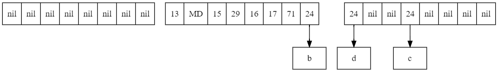

# Swiss Table

## 1.HashMap的问题

Node节点占用的内存空间过大
```
java.util.HashMap$Node object internals:
OFF  SZ                         TYPE DESCRIPTION               VALUE
  0   8                              (object header: mark)     N/A
  8   4                              (object header: class)    N/A
 12   4                          int Node.hash                 N/A
 16   4             java.lang.Object Node.key                  N/A
 20   4             java.lang.Object Node.value                N/A
 24   4       java.util.HashMap$Node Node.next                 N/A
 28   4                              (object alignment gap)    
Instance size: 32 bytes
Space losses: 0 bytes internal + 4 bytes external = 4 bytes total
```

Node使用链表指向下一节点，导致内存局部性不够好

```java
static class Node<K,V> implements Map.Entry<K,V> {
    final int hash;
    final K key;
    V value;
    Node<K, V> next;
    
    Node(int hash, K key, V value, Node<K, V> next) {
        this.hash = hash;
        this.key = key;
        this.value = value;
        this.next = next;
    }
}
```

## 2.Swiss table 的结构

Swiss table 属于开放寻址法的一个变种，所以是扁平化的，我们先初始化三个数组，meta 数组中的每一个 byte 对应 keys 数组中的元素的三种状态 `key不存在`，`key存在`，`标记key删除`。
使用开放寻址法实现的 map 每个节点仅占用 9 个 byte(1 meta + 4 keyref + 4 valref)，每个节点节省32 - 9 = 23 个字节， 并且内存局部性更好。

### 2.1 初始化与分组

```python
byte EMPTY = -128
byte TOMBSTONE = -2

byte[] meta = EMPTY.repeat(n)
Object[] keys = nil.repeat(n)
Object[] vals = nil.repeat(n)
```

```python

# 对上述的数组进行分组，每8个元素一个分组

func byte[] meta(int group)
    return meta.slice(group * 8, 8)
    
func Object[] keyGroup(int group)
    return keys.slice(group * 8, 8)
    
func Object[] valGroup(int group)
    return vals.slice(group * 8, 8)
```

### 2.2 hash函数

```python
# 将hash拆分成两段，前57bit决定key在哪个group, 后7bit决定key在这个group的哪一个位置

func long hash(Object key)
    return key.hashcode
    
func long hi57(long hash)
    return (hash & 0xFFFFFFFFFFFFFF80L) >> 7
    
func byte lo07(long hash)
    return cast(hash & 0x000000000000007FL, byte)
```


### 2.3 matchH2 函数

```python
# 找到某一group中所有等于低位7bit hash的位置

func int[] matchH2(int group, byte h2)
    byte[] result = []
    byte[] meta = meta(group)
    
    for i = 0; i < meta.length; i++
        if meta[i] == h2
            result.append(i)

    return result
```

### 2.4 matchEmpty 函数

```python

# 找到某一group中所有空元素的位置

func int[] matchEmpty(int group)
    byte[] result = []
    byte[] meta = meta(group)
    
    for i = 0; i < meta.length; i++
        if meta[i] == EMPTY
            result.append(i)

    return result
```

## 3.Swiss table 的实现

### 3.1 put方法

```python
func void put(Object key, Object val)
    long hash = hash(key)
    
    long h1 = hi57(hash)
    byte h2 = lo07(hash)
    
    int g = h1 % groups.length
    
    for i = g; i < groups.length;
        
        int[] matches = matchH2(i, h2)
        
        for p in matches
            if keyGroup(i)[p] equals key
                // replace
                valGroup(i)[p] = value
                return
        
        matches = matchEmpty(i)
        for p in matches
            // add
            meta(i)[p] = h2
            keyGroup(i)[p] = key
            valGroup(i)[p] = val
            size++
            return
        
        i++
        if i >= groups.length
            i = 0
```

#### 例1： put一个元素<key = d, group = 1, h2 = 24>


在 group1 中找到 2 个 h2 等于 24 的位置 [1, 7] 但没有 key 等于 d，并且 group1 没有空元素，所以到 group2 中继续寻找，位置 3 也不等于 d，但是该组有空元素，所以把 d 插入第一个空的位置 0 


### 3.2 get方法

```python
func Object get(Object key)
    long hash = hash(key)
    
    long h1 = hi57(hash)
    byte h2 = lo07(hash)
    
    int g = h1 % groups.length
    
    for i = g; i < groups.length;
        
        int[] matches = matchH2(i, h2)
        
        for p in matches
            if keyGroup(i)[p] equals key
                Object val = valGroup(i)[p]
                return val
        
        matches = matchEmpty(i)
        
        // fast path
        if matches.length > 0
            return nil
        
        i++
        if i >= groups.length
            i = 0
```

#### 例2: get一个元素<key = c, group = 2, h2 = 24>


在 group2 中找到 2 个 h2 等于 24 的位置 [0, 3] 通过比较得知位置 3 的 key 等于 c , 返回位置 3 的 value

#### 例3: get一个元素<key = d, group = 1, h2 = 24>


在 group1 中找到 2 个 h2 等于 24 的位置 [1, 7] 但没有 key 等于 d 并且 group1 中没有空元素，所以我们到 group2 中继续查找位置[0, 3] ，在位置 0 中 的 key 等于 d， 返回位置 0 的 value

#### 例4: get一个元素<key = f, group = 1, h2 = 24>


在 group1 中找到 2 个 h2 等于 24 的位置 [1, 7] 但没有 key 等于 f 并且 group1 中没有空元素，所以我们到 group2 中继续查找位置 [0, 3] ，也没找到 f ，但我们在 group2 中找到有空元素位置，所以我们判定 f 不存在，返回 nil

### 3.3 remove方法

```python
func void remove(Object key)
    long hash = hash(key)
    
    long h1 = hi57(hash)
    byte h2 = lo07(hash)
    
    int g = h1 % groups.length
    
    for i = g; i < groups.length;
    
        int[] matches = matchH2(i, h2)
        
        for p in matches
            if keyGroup(i)[p] equals key
            
                keyGroup(i)[p] = nil
                valGroup(i)[p] = nil
                
                if matchEmpty(i).length > 0
                    // deleted
                    meta(i)[p] = EMPTY
                    size--
                else
                    // mark deleted
                    meta(i)[p] = TOMBSTONE
                    dead++
                return
                    
        matches = matchEmpty(i)
        
        if matches.length > 0
            // not found
            return
        
        i++
        if i >= groups.length
            i = 0
```

#### 例5: del一个元素<key = a, group = 1, h2 = 24>


我们根据之前的方法定位到元素 a 的位置在 group1 中的位置 1， 由于这个 group 没有其他空元素， 我们只能标记这个节点删除， 删除后如下



#### 例6: del一个元素<key = d, group = 1, h2 = 24>

在 group1 中找到 1 个 h2 等于 24 的位置 7 但没有 key 等于 d 并且 group1 中没有空元素(元素 a 被标记删除)，所以我们到 group2 中继续查找位置 [0, 3]，位置 0 中 的 key 等于 d， 由于 group2 中有其他空元素， 所以我们实际删除 d。删除后如下


### 3.4 resize

```python
func int size()
    return size - dead
```

```python
func boolean resize() 
    if size < totalsize * 0.75
        return false
    
    int next
    if dead >= size / 2
        next = groups.length
    else
        next = groups.length * 2
    
    Object[] prevkeys = keys
    Object[] prevvals = vals
    
    initMeta(next)
    keys = initKeyGroup(next)
    vals = initValGroup(next)
    
    for key, val in prevkeys, prevvals
        put(key, val)
        
    return true
```

改写`put`方法

```python
func void put(Object key, Object val)
    long hash = hash(key)
    
    long h1 = hi57(hash)
    byte h2 = lo07(hash)
    
    int g = h1 % groups.length
    
    for i = g; i < groups.length;
        
        int[] matches = matchH2(i, h2)
        
        for p in matches
            if keyGroup(i)[p] equals key
                // replace
                valGroup(i)[p] = value
                return
        
        matches = matchEmpty(i)
        for p in matches
            if resize()
                add(key, val, h1, h2)
            else
                meta(i)[p] = h2
                keyGroup(i)[p] = key
                valGroup(i)[p] = val
                size++
                return
                
        i++
        if i >= groups.length
            i = 0
```

```python
func void add(Object key, Object val, long h1, byte h2)
    int g = h1 % groups.length
    
    for i = g; i < groups.length;
    
        int[] matches = matchEmpty(i)
        
        for p in matches
            meta(i)[p] = h2
            keyGroup(i)[p] = key
            valGroup(i)[p] = val
            size++
        
        i++
        if i >= groups.length
            i = 0
```

## 4. SIMD简介

SIMD 全称叫做 single instruction multiple data 。现代 CPU 具有固定大小的 SIMD 寄存器：128 位（SSE）、256 位（AVX）或 512 位（AVX512）。现代台式机 CPU 的 SIMD 宽度通常为 256 位，高端服务器 CPU 的宽度为 512 位。嵌入式 CPU 的宽度大多为 128 位。


### 4.1 SIMD的优势
1. SIMD 几乎适用于所有 CPU。只有低端的嵌入式 CPU 才没有 SIMD
2. SIMD 确实是执行并行化最便宜的方法。其他并行化技术（如多线程或GPU计算）都有“预热”成本。当输入较小时，启动线程或将数据复制到显卡的成本可能比进行实际计算的成本更高。

```
for (int i = 0; i < n; i++) {
    a[i] = b[i] + c[i];
}
```

上述代码在JIT中会自动做SIMD优化

## 5. 优化

### 5.1 SIMD优化

使用SIMD优化matchH2与matchEmpty, 首先加入参数`--add-modules=jdk.incubator.vector` 与`--enable-preview` 开启Jdk的预览功能Vector

```java
public long matchH2(int offset, byte h2) {
    ByteVector v = ByteVector.fromArray(SPECIES_PREFERRED, data, offset);
    return v.eq(h2).toLong();
}

public long matchEmpty(int offset) {
    ByteVector v = ByteVector.fromArray(SPECIES_PREFERRED, data, offset);
    return v.eq(EMPTY).toLong();
}
```

安装`hsdis`并加入启动参数`-XX:+UnlockDiagnosticVMOptions -XX:CompileCommand=print,*SwissMap.matchH2` 查看生成的汇编代码

```
vmovdqu 0x10(%r10,%r8,1),%ymm0
vpbroadcastb %xmm1,%ymm1
vpcmpeqb %ymm1,%ymm0,%ymm0
```

### 5.2 位运算模拟SIMD

```java
public static long LO_BITS = 0x0101010101010101L;
public static long HI_BITS = 0x8080808080808080L;

public long matchH2(int offset, byte h2) {
    long v1 = Unsafes.getLong(data, offset, ByteOrder.nativeOrder());
    long v2 = v1 ^ (LO_BITS * h2);
    return (v2 - LO_BITS) & ~v2 & HI_BITS;
}

public long matchEmpty(int offset) {
    long v1 = Unsafes.getLong(data, offset, ByteOrder.nativeOrder());
    long v2 = v1 ^ HI_BITS;
    return (v2 - LO_BITS) & ~v2 & HI_BITS;
}
```

### 5.3 性能测试

```
 Benchmark                            Mode  Cnt          Score         Error  Units
 SwissMapBenchmark.benchHashMapGet   thrpt    8  597537213.509 ± 5366726.749  ops/s
 SwissMapBenchmark.benchHashMapPut   thrpt    8    2062104.025 ±   45673.362  ops/s
 SwissMapBenchmark.benchSwissMapGet  thrpt    8  240013243.613 ±  983660.577  ops/s
 SwissMapBenchmark.benchSwissMapPut  thrpt    8    2146739.000 ±   61301.517  ops/s
```

## 6. References

1. [Swiss Tables Design Notes](https://abseil.io/about/design/swisstables)
2. [CppCon 2017: Matt Kulukundis “Designing a Fast, Efficient, Cache-friendly Hash Table, Step by Step”](https://www.youtube.com/watch?v=ncHmEUmJZf4&t=2496s)
3. [Java SIMD](https://vksegfault.github.io/posts/java-simd/)
4. [how-to-see-jit-compiled-code-in-jvm](https://stackoverflow.com/questions/1503479/how-to-see-jit-compiled-code-in-jvm#15146962)
5. [hsdis download](https://chriswhocodes.com/hsdis/)
6. [Crash course introduction to parallelism: SIMD Parallelism](https://johnnysswlab.com/crash-course-introduction-to-parallelism-simd-parallelism/)
7. [Determine if a word has a byte equal to n](https://graphics.stanford.edu/~seander/bithacks.html#ValueInWord)