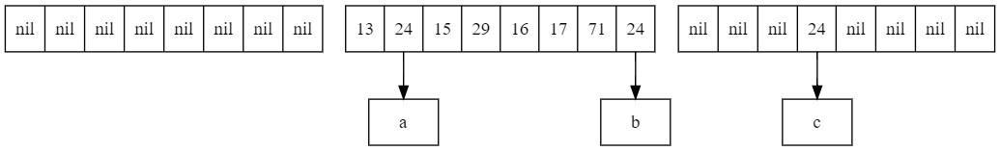
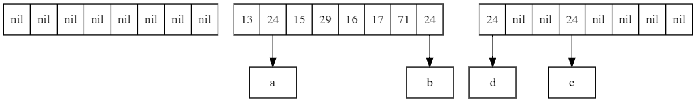
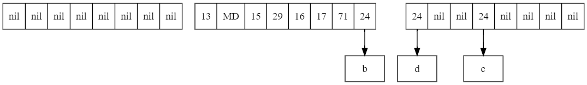
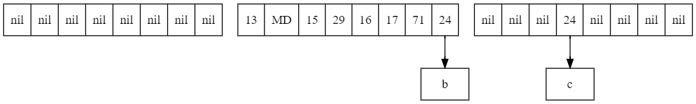
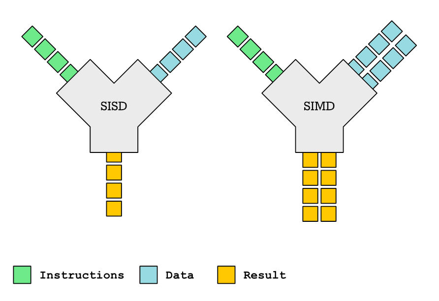

# Swiss Table

## 1. Problems with HashMap

The memory space occupied by Node objects is too large.
```
java.util.HashMap$Node object internals:
OFF  SZ                         TYPE DESCRIPTION               VALUE
  0   8                              (object header: mark)     N/A
  8   4                              (object header: class)    N/A
 12   4                          int Node.hash                 N/A
 16   4             java.lang.Object Node.key                  N/A
 20   4             java.lang.Object Node.value                N/A
 24   4       java.util.HashMap$Node Node.next                 N/A
 28   4                              (object alignment gap)
Instance size: 32 bytes
Space losses: 0 bytes internal + 4 bytes external = 4 bytes total
```

Node uses a linked list to point to the next node, resulting in poor memory locality.

```java
static class Node<K,V> implements Map.Entry<K,V> {
    final int hash;
    final K key;
    V value;
    Node<K, V> next;

    Node(int hash, K key, V value, Node<K, V> next) {
        this.hash = hash;
        this.key = key;
        this.value = value;
        this.next = next;
    }
}
```

## 2. Structure of a Swiss Table

A Swiss table is a variation of open addressing, so it is flat. We first initialize three arrays. Each byte in the `meta` array corresponds to one of three states for an element in the `keys` array: `key does not exist`, `key exists`, or `key is marked as deleted`.
A map implemented with open addressing occupies only 9 bytes per node (1 meta + 4 keyref + 4 valref), saving 32 - 9 = 23 bytes per node and providing better memory locality.

### 2.1 Initialization and Grouping

```python
byte EMPTY = -128
byte TOMBSTONE = -2

byte[] meta = EMPTY.repeat(n)
Object[] keys = nil.repeat(n)
Object[] vals = nil.repeat(n)
```

```python

# Group the above arrays, with 8 elements per group

func byte[] meta(int group)
    return meta.slice(group * 8, 8)

func Object[] keyGroup(int group)
    return keys.slice(group * 8, 8)

func Object[] valGroup(int group)
    return vals.slice(group * 8, 8)
```

### 2.2 Hash Function

```python
# Split the hash into two parts: the first 57 bits determine which group the key is in, and the last 7 bits determine the key's position within that group.

func long hash(Object key)
    return key.hashcode

func long hi57(long hash)
    return (hash & 0xFFFFFFFFFFFFFF80L) >> 7

func byte lo07(long hash)
    return cast(hash & 0x000000000000007FL, byte)
```

### 2.3 matchH2 Function

```python
# Find all positions in a group where the hash equals the lower 7 bits.

func int[] matchH2(int group, byte h2)
    byte[] result = []
    byte[] meta = meta(group)

    for i = 0; i < meta.length; i++
        if meta[i] == h2
            result.append(i)

    return result
```

### 2.4 matchEmpty Function

```python

# Find all empty element positions in a group.

func int[] matchEmpty(int group)
    byte[] result = []
    byte[] meta = meta(group)

    for i = 0; i < meta.length; i++
        if meta[i] == EMPTY
            result.append(i)

    return result
```

## 3. Implementation of Swiss Table

### 3.1 put Method

```python
func void put(Object key, Object val)
    long hash = hash(key)

    long h1 = hi57(hash)
    byte h2 = lo07(hash)

    int g = h1 % groups.length

    for i = g; i < groups.length;

        int[] matches = matchH2(i, h2)

        for p in matches
            if keyGroup(i)[p] equals key
                // replace
                valGroup(i)[p] = value
                return

        matches = matchEmpty(i)
        for p in matches
            // add
            meta(i)[p] = h2
            keyGroup(i)[p] = key
            valGroup(i)[p] = val
            size++
            return

        i++
        if i >= groups.length
            i = 0
```

#### Example 1: Put an element <key = d, group = 1, h2 = 24>


In group 1, two positions [1, 7] are found where h2 equals 24, but no key equals 'd', and there are no empty elements in group 1. So, we continue to group 2. Position 3 is not equal to 'd', but this group has an empty element, so we insert 'd' into the first empty position, which is 0.



### 3.2 get Method

```python
func Object get(Object key)
    long hash = hash(key)

    long h1 = hi57(hash)
    byte h2 = lo07(hash)

    int g = h1 % groups.length

    for i = g; i < groups.length;

        int[] matches = matchH2(i, h2)

        for p in matches
            if keyGroup(i)[p] equals key
                Object val = valGroup(i)[p]
                return val

        matches = matchEmpty(i)

        // fast path
        if matches.length > 0
            return nil

        i++
        if i >= groups.length
            i = 0
```

#### Example 2: Get an element <key = c, group = 2, h2 = 24>


In group 2, two positions [0, 3] are found where h2 equals 24. By comparison, we know that the key at position 3 is equal to 'c', so we return the value at position 3.

#### Example 3: Get an element <key = d, group = 1, h2 = 24>


In group 1, two positions [1, 7] are found where h2 equals 24, but no key equals 'd', and there are no empty elements in group 1. So we continue to search in group 2 at positions [0, 3]. The key at position 0 is equal to 'd', so we return the value at position 0.

#### Example 4: Get an element <key = f, group = 1, h2 = 24>


In group 1, two positions [1, 7] are found where h2 equals 24, but no key equals 'f', and there are no empty elements in group 1. So we continue to search in group 2 at positions [0, 3]. We don't find 'f' there either, but we find an empty element in group 2, so we determine that 'f' does not exist and return nil.

### 3.3 remove Method

```python
func void remove(Object key)
    long hash = hash(key)

    long h1 = hi57(hash)
    byte h2 = lo07(hash)

    int g = h1 % groups.length

    for i = g; i < groups.length;

        int[] matches = matchH2(i, h2)

        for p in matches
            if keyGroup(i)[p] equals key

                keyGroup(i)[p] = nil
                valGroup(i)[p] = nil

                if matchEmpty(i).length > 0
                    // deleted
                    meta(i)[p] = EMPTY
                    size--
                else
                    // mark deleted
                    meta(i)[p] = TOMBSTONE
                    dead++
                return

        matches = matchEmpty(i)

        if matches.length > 0
            // not found
            return

        i++
        if i >= groups.length
            i = 0
```

#### Example 5: Delete an element <key = a, group = 1, h2 = 24>


Using the previous method, we locate element 'a' at position 1 in group 1. Since this group has no other empty elements, we can only mark this node as deleted. After deletion, it looks like this:



#### Example 6: Delete an element <key = d, group = 1, h2 = 24>

In group 1, one position 7 is found where h2 equals 24, but the key is not 'd', and there are no empty elements in group 1 (element 'a' is marked as deleted). So we continue to search in group 2 at positions [0, 3]. The key at position 0 is equal to 'd'. Since group 2 has other empty elements, we actually delete 'd'. After deletion, it looks like this:



### 3.4 resize

```python
func int size()
    return size - dead
```

```python
func boolean resize()
    if size < totalsize * 0.75
        return false

    int next
    if dead >= size / 2
        next = groups.length
    else
        next = groups.length * 2

    Object[] prevkeys = keys
    Object[] prevvals = vals

    initMeta(next)
    keys = initKeyGroup(next)
    vals = initValGroup(next)

    for key, val in prevkeys, prevvals
        put(key, val)

    return true
```

Rewrite the `put` method:

```python
func void put(Object key, Object val)
    long hash = hash(key)

    long h1 = hi57(hash)
    byte h2 = lo07(hash)

    int g = h1 % groups.length

    for i = g; i < groups.length;

        int[] matches = matchH2(i, h2)

        for p in matches
            if keyGroup(i)[p] equals key
                // replace
                valGroup(i)[p] = value
                return

        matches = matchEmpty(i)
        for p in matches
            if resize()
                add(key, val, h1, h2)
            else
                meta(i)[p] = h2
                keyGroup(i)[p] = key
                valGroup(i)[p] = val
                size++
                return

        i++
        if i >= groups.length
            i = 0
```

```python
func void add(Object key, Object val, long h1, byte h2)
    int g = h1 % groups.length

    for i = g; i < groups.length;

        int[] matches = matchEmpty(i)

        for p in matches
            meta(i)[p] = h2
            keyGroup(i)[p] = key
            valGroup(i)[p] = val
            size++

        i++
        if i >= groups.length
            i = 0
```

## 4. Introduction to SIMD

SIMD stands for single instruction multiple data. Modern CPUs have fixed-size SIMD registers: 128-bit (SSE), 256-bit (AVX), or 512-bit (AVX512). The SIMD width of modern desktop CPUs is usually 256 bits, while high-end server CPUs have a width of 512 bits. Most embedded CPUs have a width of 128 bits.



### 4.1 Advantages of SIMD
1. SIMD is available on almost all CPUs. Only low-end embedded CPUs do not have SIMD.
2. SIMD is indeed the cheapest way to perform parallelization. Other parallelization techniques (such as multithreading or GPU computing) have a "warm-up" cost. When the input is small, the cost of starting a thread or copying data to the graphics card may be higher than the cost of the actual calculation.

```
for (int i = 0; i < n; i++) {
    a[i] = b[i] + c[i];
}
```

The above code is automatically optimized with SIMD by the JIT.

## 5. Optimization

### 5.1 SIMD Optimization

Use SIMD to optimize `matchH2` and `matchEmpty`. First, add the parameters `--add-modules=jdk.incubator.vector` and `--enable-preview` to enable the JDK's preview feature, Vector.

```java
public long matchH2(int offset, byte h2) {
    ByteVector v = ByteVector.fromArray(SPECIES_PREFERRED, data, offset);
    return v.eq(h2).toLong();
}

public long matchEmpty(int offset) {
    ByteVector v = ByteVector.fromArray(SPECIES_PREFERRED, data, offset);
    return v.eq(EMPTY).toLong();
}
```

Install `hsdis` and add the startup parameter `-XX:+UnlockDiagnosticVMOptions -XX:CompileCommand=print,*SwissMap.matchH2` to view the generated assembly code.

```
vmovdqu 0x10(%r10,%r8,1),%ymm0
vpbroadcastb %xmm1,%ymm1
vpcmpeqb %ymm1,%ymm0,%ymm0
```

### 5.2 Simulating SIMD with Bitwise Operations

```java
public static long LO_BITS = 0x0101010101010101L;
public static long HI_BITS = 0x8080808080808080L;

public long matchH2(int offset, byte h2) {
    long v1 = Unsafes.getLong(data, offset, ByteOrder.nativeOrder());
    long v2 = v1 ^ (LO_BITS * h2);
    return (v2 - LO_BITS) & ~v2 & HI_BITS;
}

public long matchEmpty(int offset) {
    long v1 = Unsafes.getLong(data, offset, ByteOrder.nativeOrder());
    long v2 = v1 ^ HI_BITS;
    return (v2 - LO_BITS) & ~v2 & HI_BITS;
}
```

### 5.3 Performance Testing

```
 Benchmark                            Mode  Cnt          Score         Error  Units
 SwissMapBenchmark.benchHashMapGet   thrpt    8  597537213.509 ± 5366726.749  ops/s
 SwissMapBenchmark.benchHashMapPut   thrpt    8    2062104.025 ±   45673.362  ops/s
 SwissMapBenchmark.benchSwissMapGet  thrpt    8  240013243.613 ±  983660.577  ops/s
 SwissMapBenchmark.benchSwissMapPut  thrpt    8    2146739.000 ±   61301.517  ops/s
```

## 6. References

1. [Swiss Tables Design Notes](https://abseil.io/about/design/swisstables)
2. [CppCon 2017: Matt Kulukundis “Designing a Fast, Efficient, Cache-friendly Hash Table, Step by Step”](https://www.youtube.com/watch?v=ncHmEUmJZf4&t=2496s)
3. [Java SIMD](https://vksegfault.github.io/posts/java-simd/)
4. [how-to-see-jit-compiled-code-in-jvm](https://stackoverflow.com/questions/1503479/how-to-see-jit-compiled-code-in-jvm#15146962)
5. [hsdis download](https://chriswhocodes.com/hsdis/)
6. [Crash course introduction to parallelism: SIMD Parallelism](https://johnnysswlab.com/crash-course-introduction-to-parallelism-simd-parallelism/)
7. [Determine if a word has a byte equal to n](https://graphics.stanford.edu/~seander/bithacks.html#ValueInWord)
