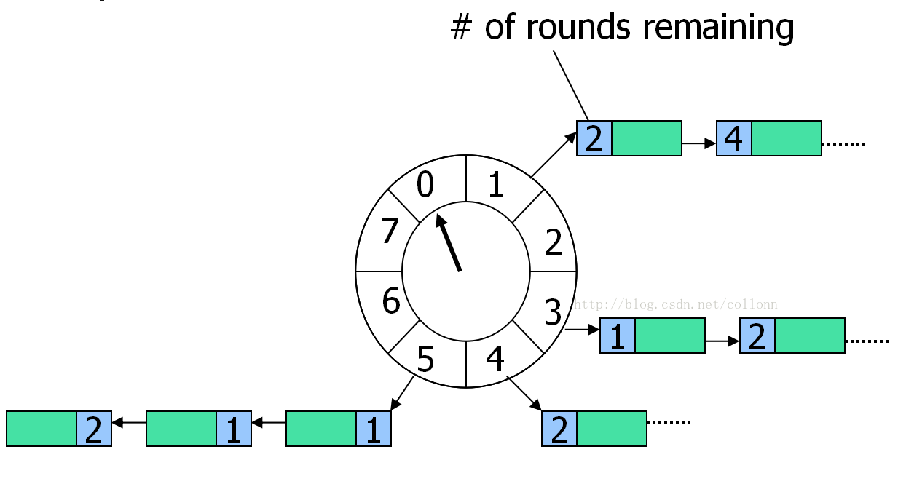
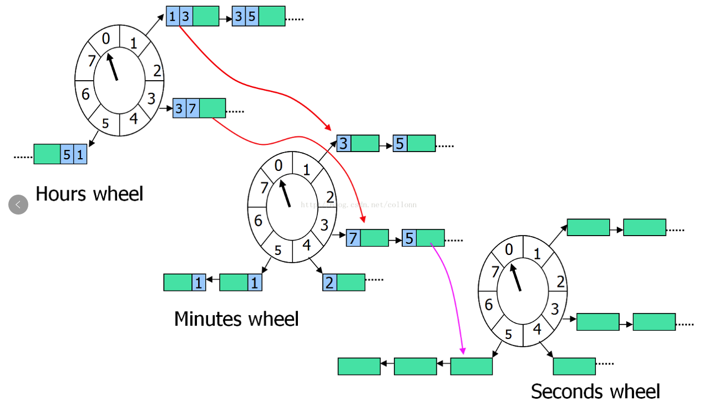

<!-- page_number: true -->
<!-- $size: 16:9 -->
# Hashed Wheel Timer

1. 简介
2. 复杂度分析
3. 数据结构
4. 实现细节
5. 性能
6. Hashed Hierarchical Timing Wheel
---

## 1. 简介

Hashed Wheel Timer 主要用来高效处理大量定时任务， 可以对任务进行高效的schedule和unschedule操作。

在Netty, Kafka中都有应用。

* [Kafka Timer](https://github.com/apache/kafka/blob/trunk/core/src/main/scala/kafka/utils/timer/Timer.scala)
* [Netty Timer](https://github.com/netty/netty/blob/4.1/common/src/main/java/io/netty/util/HashedWheelTimer.java)


---

## 2. 复杂度分析

**ScheduledThreadPoolExecutor**

* O(log N) for adding new task
* O(1) per each timer tick
* O(log N) cancelling the task

**HashedWheelTimer**

* O(1) for adding new task
* O(m) per each timer tick（m = bucket.size）
* O(1) for cancelling a task
---

## 3. 数据结构


---
## 4. 实现细节

### 4.1. 线程模型

```java

                  +------------+
                  |Timing Wheel|       task  +-----------+
                  +------------+     +------>|  Worker1  |
                         |           |       +-----------+
+------+  submit  +------------+     | task  +-----------+
| Task |--------->|   Master   |-----|------>|  Worker2  |
+------+          +------------+     |       +-----------+
                                     | task  +-----------+
                                     +------>|  Worker3  |
                                             +-----------+

```

---
### 4.2. 实现细节
#### 4.2.1. Timing wheel

```java  
while (running.get()) {
    Set<Task<?>> bucket = ring[cursor];
    for (Task<?> task : bucket) {
        if (task.isCancelled()) {
            bucket.remove(task);
        } else if (task.rounds == 0) {
            execute(task); // submit to worker thread
            bucket.remove(task);
            if (task.isReschedule()) // scheduleAtFixedRate
                task.reschedule();
        } else {
            task.rounds--
        }
    }
    this.idle.delay(tick);
    cursor = (cursor + 1) & (size - 1)
}
```

---
#### 4.2.2. Task

```java
public interface Task<T> extends ScheduledFuture<T>, Runnable {
	boolean isReschedule(); void reschedule();
}
```

---
#### 4.2.3. schedule

```java
public <T> ScheduledFuture<T> schedule(Callable<T> callable, long delay, TimeUnit u) {
    final int offset1 = (int) (delay / tick), rounds1 = (offset1 / size);
    Task<T> task = new OneShotTask<T>(rounds1, offset1, callable)
    ring[(cursor+offset1) & (size-1)].add(task);
    return task;
}
```
```java
public boolean isReschedule() {
    return false;
}
	
public void reschedule() {
    throw new UnsupportedOperationException();
}
```

---

#### 4.2.4. scheduleAtFixedRate

```java
public ScheduledFuture<?> scheduleAtFixedRate(Runnable r, long d, long p, TimeUnit u){
    final int offset1 = (int) (d / tick), rounds1 = (offset1 / size);
    final int offset2 = (int) (p / tick), rounds2 = (offset2 / size);
    Task<T> task = new FixedRateTask(rounds1, offset1, r, rounds2, offset2);
    ring[(cursor+offset1) & (size-1)].add(task);
    return task;
}
```

```java
public boolean isReschedule() {
    return true;
}
	
public void reschedule() {
    this.canceled.set(false);
    this.rounds1 = this.rounds2;
    this.offset1 = this.offset2;
    ring[(cursor+offset1) & (size-1)].add(task);
}
```

---
#### 4.2.5. scheduleWithFixedDelay

```java
public ScheduledFuture<?> scheduleWithFixedDelay(Runnable r, long d, long p, TimeUnit u){
    final int offset1 = (int) (d / tick), rounds1 = (offset1 / size);
    final int offset2 = (int) (p / tick), rounds2 = (offset2 / size);
    Task<T> task = new FixedDelayTask(rounds1, offset1, r, rounds2, offset2);
    ring[(cursor+offset1) & (size-1)].add(task);
    return task;
}
```
```java
public boolean isReschedule() {
    return false; // see #run()
}
	
public void run() {
    super.run(); reschedule();
}
	
public void reschedule() {
    this.canceled.set(false);
    this.rounds1 = this.rounds2;
    this.offset1 = this.offset2;
    ring[(cursor+offset1) & (size-1)].add(task);
}
```

---
#### 4.2.6. bucket实现细节

```java
            |<-------bucket------>|
+------+    +---+    +---+    +---+
| tick |--->| 0 |--->| 0 |--->| 1 |
+------+    +---+    +---+    +---+
   |
+------+
| tick |--->........
+------+
   |
+------+
| tick |--->........
+------+

```

---
## 5. 性能

```
 Benchmark                     Mode  Cnt        Score        Error  Units
 benchmarkScheduledExecutor   thrpt  200   795377.428 ± 176042.240  ops/s
 benchmarkXScheduledExecutor  thrpt  200  7452524.500 ±  79330.412  ops/s
 (100ms tick, 512 wheel size)
```

---
### 6. Hashed Hierarchical Timing Wheel

