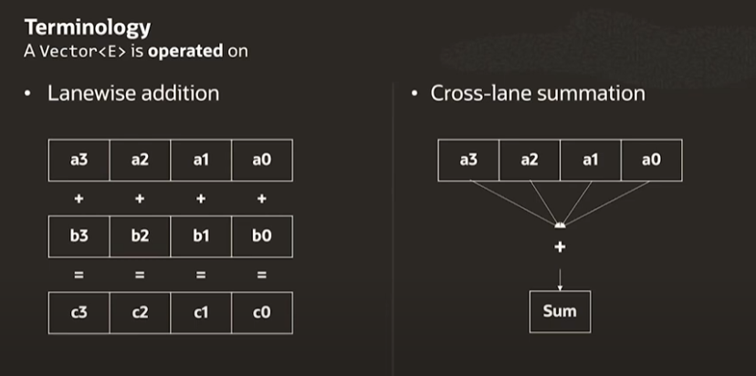

# Vector API 简介
----------------

# 概念
 * SIMD
 * Species
 * Lanes

----------------
### Single instruction, multiple data


----------------

```
Lane-wise operations: operate on a given lane for two vectors

ADD, SUB, etc... are lane-wise operations
```
```
Cross-lane operations: operate on the different lanes of a vector

MAX, MIN, SORT are cross-lanes operations
```

----------------



----------------

### 数组加法（1）
```java
VectorSpecies<Integer> species = IntVector.SPECIES_128;

int n = 4;
int[] i1 = new int[]{1, 2, 3, 4};
int[] i2 = new int[]{4, 3, 2, 1};
int[] result = new int[n];

var v1 = IntVector.fromArray(species, i1, 0);
var v2 = IntVector.fromArray(species, i2, 0);

var v = v1.add(v2);
v.intoArray(result, 0);
```
----------------

### 数组加法（2）
```java
VectorSpecies<Integer> species = IntVector.SPECIES_128;

int n = 8;
int[] i1 = new int[]{1, 2, 3, 4, 5, 6, 7, 8};
int[] i2 = new int[]{8, 7, 6, 5, 4, 3, 2, 1};
int[] result = new int[n];

for (int index = 0; index < n; index += species.length()) {
    var v1 = IntVector.fromArray(species, i1, index);
    var v2 = IntVector.fromArray(species, i2, index);
    var v = v1.add(v2);
    v.intoArray(result, index);
}

```
----------------

### 数组加法（3）
```java
VectorSpecies<Integer> species = IntVector.SPECIES_128;

int n = 9;
int[] i1 = new int[]{1, 2, 3, 4, 5, 6, 7, 8, 9};
int[] i2 = new int[]{9, 8, 7, 6, 5, 4, 3, 2, 1};
int[] result = new int[n];

for (int index = 0; index < n; index += species.length()) {
    var mask = species.indexInRange(index, n);
    var v1 = IntVector.fromArray(species, i1, index, mask);
    var v2 = IntVector.fromArray(species, i2, index, mask);
    var v = v1.add(v2, mask);
    v.intoArray(result, index, mask);
}

```
----------------


----------------

### 数组加法（4）
```java
VectorSpecies<Integer> species = IntVector.SPECIES_128;

int n = 9;
int[] i1 = new int[]{1, 2, 3, 4, 5, 6, 7, 8, 9};
int[] i2 = new int[]{9, 8, 7, 6, 5, 4, 3, 2, 1};
int[] result = new int[n];

int index = 0;
for (; index < species.loopBound(n); index += species.length()) {
    var v1 = IntVector.fromArray(species, i1, index);
    var v2 = IntVector.fromArray(species, i2, index);
    var v = v1.add(v2);
    v.intoArray(result, index);
}

for (; index < n; index++) {
    result[index] = i1[index] + i2[index];
}
```
----------------

### 求一组向量的模 $norm=\sqrt{x^2+y^2+z^2+...}$

```java
VectorSpecies<Double> species = DoubleVector.SPECIES_256;

int n = 17;
double[] ary = new double[]{...};

double sum = 0d;
for (int index = 0; index < n; index += species.length()) {
    var mask = species.indexInRange(index, n);
    var v = DoubleVector.fromArray(species, ary, index, mask);
    v = v.mul(v, mask);
    sum += v.reduceLanes(VectorOperators.ADD, mask);
}

double norm = Math.sqrt(sum);
```
----------------
```java
VectorSpecies<Double> species = DoubleVector.SPECIES_256;

int n = 17;
double[] ary = new double[]{...};

var sum = DoubleVector.zero(species);
for (int index = 0; index < n; index += species.length()) {
    var mask = species.indexInRange(index, n);
    var v = DoubleVector.fromArray(species, ary, index, mask);
    v = v.mul(v, mask);
    sum = sum.add(v, mask);
}

double norm = Math.sqrt(sum.reduceLanes(VectorOperators.ADD));

```
----------------

### Vector元素过滤
```java
VectorSpecies<Integer> species = IntVector.SPECIES_128;

int maxIndex = 0;
int[] ary = new int[]{1, 3, 4, 6, 9, 2, 5, 8, 7};
int[] result = new int[ary.length];
for (int index = 0; index < ary.length; index += species.length()) {
    var mask1 = species.indexInRange(index, ary.length);
    var v = IntVector.fromArray(species, ary, index, mask1);

    var mask2 = v.compare(VectorOperators.GT, -1);
    v = v.compress(mask2);
    v.intoArray(result, maxIndex, mask1);
    maxIndex += mask2.trueCount();
}
```