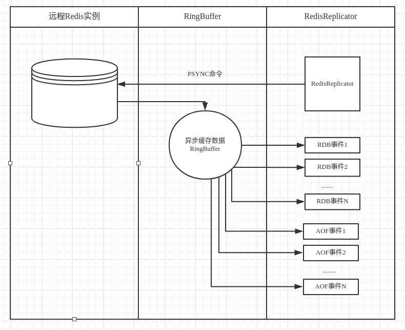

首先自我介绍一下，我是来自[攻城狮朋友圈](http://www.moilioncircle.com/)的陈宝仪。很荣幸能加入Redis技术交流群；并在Redis开发的各位同行之中做此次分享。我今天分享的主要内容围绕[Redis-replicator](https://github.com/leonchen83/redis-replicator)的设计与实现，提纲如下：  
  
1. Redis-replicator的设计动机
2. Redis replication的协议简析
3. Redis-repicator的设计与实现
4. 设计可插拔式API以及开发中的取舍
5. 总结

## 1. Redis-replicator的设计动机

在之前的开发中，经常有如下的需求  
  
* Redis数据的跨机房同步
* 异构数据的迁移；比如Redis到mysql，MQ

Redis跨机房同步传统的方式通常采取双写的方式，这样会生产一种非常难以维护的用户代码；稍微好一点的做法是提炼出一个中间层。但也难以保证同时双写成功，因此又需要作复杂的异常处理，并且降低了程序的响应时间。除了双写的方式，还有一种方式是利用Redis自身的replication协议，让一台机器成为另一台机器的slave，用此种方式来同步数据。这种方式的问题是，双机房中必须有一个是master，一个是slave。在切换的过程中，需要作slave提升等处理，也变相增加了运维难度。特别是集群环境中，期望两个机房各一个集群，每个集群独立运行互不干扰，并且保持数据同步。  
如图所示：  

  
上面一段属于同构数据迁移，再来说异构数据迁移，现实需求中，有可能会有异构迁移的情况，比如Redis每日数据量很大，需要把一些数据以文件或者数据库存储的方式落盘（mysql， MQ， SSDB..），每日异地备份等等，如果还是采用双写等方式处理的话，又会有代码扩张，维护困难等上述提过的问题。  
如图所示：  

  
在以上的需求中，催生了我开发Redis-replicator的动机。 这个工具完美实现了Redis replication协议，并把RDB以及AOF解析成为一个一个的事件供用户消费，并且支持Redis4.0的新特性以及新命令。如果用Redis-replicator来实现上述需求的话，可以不干扰用户态的代码，单独用这个工具实现中间件来进行异构，同构数据同步备份等任务。  

## 2. Redis replication的协议简析

讲到这里，就再仔细说一下Redis-replication协议，很多同学以为这个协议很复杂，实现起来很困难。但实际上如果仔细了解这个协议的话，即使用Java这种略臃肿的语言，在3000行内也可以实现一个完整的同步协议（Redis-replicator第一版5000行代码）。
那么具体的协议格式是一个非严格的AOF格式；第一个AOF是同步命令的回复，第二个AOF命令很特殊，是一个RESP Bulk String，其内包含了RDB格式。其余的AOF就是master的实时命令。了解AOF格式的话请参照[https://redis.io/topics/protocol](https://redis.io/topics/protocol)  
如图所示:  
  

#### 2.1 第一个AOF
第一个AOF的话是同步命令的回复，在同步之前我们要发送同步命令，比如2.8版本之前我们要发送`SYNC`， 2.8之后我们要发送`PSYNC repl-id repl-offset`开启PSYNC同步，repl-id占40字节，不知道repl-id的情况下发送`?`， repl-offset表示同步的offset，不知道offset的情况下发送`-1`，回复的话有可能是如下形式：`+FULLRESYNC repl-id offset\r\n`或者`+CONTINUE\r\n`或者Redis-4.0引入的PSYNC2回复`+CONTINUE repl-id\r\n`  

#### 2.2 第二个AOF
上面我们说第二个AOF是一个RESP Bulk String；那么其符合`$payload\r\nRDB\r\n`这样的形式，payload表示要传输的rdb大小，内容的话就是一个完整的RDB文件。关于RDB文件的格式，我做了一个[RDB data format wiki](https://github.com/leonchen83/redis-replicator/wiki/RDB-dump-data-format)供大家详细了解，在此不做赘述。稍微需要注意的是如果redis-server开启了`repl-diskless-sync = yes`那么这个格式会稍有变化。  
在[https://redis.io/topics/protocol](https://redis.io/topics/protocol) 文档中RESP Bulk String还有一种没有提到的格式用在同步协议中； `$EOF:<40 bytes delimiter>\r\nRDB<40 bytes delimiter>`，此时的payload变成`EOF:<40 bytes delimiter>`所以在实现同步协议的时候需要注意。第二点需要注意的是如果master产生的RDB特别巨大的时候，在同步RDB之前会发送连续的`\n`以此来维持与slave的连接。所以同步格的数据流有可能是这样的:  
`+FULLRESYNC 8de1787ba490483314a4d30f1c628bc5025eb761 2443808505\r\n\n\n\n\n\n\n$payload\r\nRDB\r\n<其他AOF命令>`

#### 2.3 其他的AOF
参照[https://redis.io/topics/protocol](https://redis.io/topics/protocol)进行解析

## 3. Redis-repicator的设计与实现

那么有了对以上同步协议的了解，我们可以很容易的实现一款自己的Redis同步协议。我所选的语言是Java，我鼓励大家也去实现不同语言的同步协议，以丰富Redis的工具链。Redis-replicator的结构如下所示  
  

通用的代码如下：

```java
        Replicator replicator = new RedisReplicator("redis://127.0.0.1:6379")；
        replicator.addRdbListener(new RdbListener.Adaptor() {
            // 解析RDB事件
            @Override
            public void handle(Replicator replicator, KeyValuePair<?> kv) {
                System.out.println(kv)；
            }
        })；
        replicator.addCommandListener(new CommandListener() {
            // 解析AOF实时命令
            @Override
            public void handle(Replicator replicator, Command command) {
                System.out.println(command)；
            }
        })；
        replicator.open()；
```

## 4. 设计可插拔式API以及开发中的取舍

#### 4.1 设计可插拔式API
我们从以上的代码中可以用很简单的方式Redis master实现同步，这小节我们主要讲Redis-replicator的扩展性，从以下几个方面来详细说明  
  
1. 当Redis-server版本升级到比如4.2，有STREAM相关的命令时如何扩展
2. 当处理比如超过本机内存的大KV如何扩展
3. 当加载Redis-4.0新特性Module（比如rejson）时如何扩展

先讨论第一点，当升级Redis-server有新的命令而Redis-replicator不支持时，可以使用命令扩展。写一个命令解析器并注册进Redis-replicator中即可handle新的命令；一个详细的例子在[CommandExtensionExample](https://github.com/leonchen83/redis-replicator/blob/master/examples/com/moilioncircle/examples/extension/CommandExtensionExample.java)  
  
再讨论第二点，由于Redis-replicator默认是把KV完全读到内存再交由用户处理的，当处理比如超过本机内存的大KV时，会引发OOM。一个比较好的方法是以迭代的方式来处理大KV。在Redis-replicator中，可以注册自己的RDB解析器来应对这种情况，一个好消息是此工具已经内置了处理大KV的RDB解析器[ValueIterableRdbVisitor](https://github.com/leonchen83/redis-replicator/blob/master/src/main/java/com/moilioncircle/redis/replicator/rdb/iterable/ValueIterableRdbVisitor.java) ，
与此相关的例子在[HugeKVSocketExample](https://github.com/leonchen83/redis-replicator/blob/master/examples/com/moilioncircle/examples/huge/HugeKVSocketExample.java)  
  
再讨论第三点，加载自定义Module时，可以实现自定义的Module parser并注册到Redis-replicator中，实现Module扩展，一个相关的例子在[ModuleExtensionExample](https://github.com/leonchen83/redis-replicator/blob/master/examples/com/moilioncircle/examples/extension/ModuleExtensionExample.java)。  
  
总结就是Redis-replicator只提供了一个同步协议的大框架，其内的命令解析，RDB解析，Module解析都是可插拔的，这样可以提供最大的灵活性给用户。  
  
#### 4.2 开发中的取舍
在此小节我要谈三个方面  
  
1. 无绪
2. 兼容
3. 依赖

##### 4.2.1 无绪
最近我读完一本书很有启发，书名叫<软件框架设计的艺术>:  

  

书中提到了一个叫`无绪`的概念；大意是当你依赖一个库，可以不用深入了解这个库的内部实现，就可直接根据API上手使用，并做出相对可靠的应用程序。对这个概念我深以为然，但是Redis-replicator是我写完之后才读的这本书，有一些不一致为了兼容性已经不可更改，但总体上根据Redis-replicator提供的文档以及example和对issue的快速回应以及修改可以让依赖此库风险可控。

##### 4.2.2 兼容
同样还是<软件框架设计的艺术>这本书，提到了一个兼容性问题。书中有一句话：**API就如同恒星，一旦出现，便与我们永恒共存**.大意就是一个API在被用户发现并使用了之后，就尽量不要做不兼容的修改，做出不兼容修改用户升级时会产生运行时错误等等问题，降低对一个库的好感度。长此不兼容的修正后，用户极有可能选择放弃这个库。我举一个在Redis-replicator中存在的例子。  
  
用户实现自己的RDB解析器时需要继承[RdbVisitor](https://github.com/leonchen83/redis-replicator/blob/master/src/main/java/com/moilioncircle/redis/replicator/rdb/RdbVisitor.java) 这个类，这个类如果被设计成接口， Redis每增加一个存储结构，这个接口就要增加一个方法，即使用户没用到这么高版本的Resis也要对实现类进行修改。设计成抽象类的话，每次升级Redis-replicator，不会对用户代码造成影响，仅仅在同时升级了Redis-server的时候才会出现异常。

##### 4.2.3 依赖
开发基础库上选择依赖一定要更加谨慎。因为java的jar hell等原因，在一个稍微复杂的系统中，出现循环依赖，以及依赖同一个包的不同版本会经常发生。比如在一个工程中经常有多个版本的slf4j-api，netty。在不实际运行的话很难发现问题。第二点就是在设计公共库的时候，在最好不要依赖具体的log实现，要尽量依赖log的api。一个不好的例子是
```xml
        <dependency>
            <groupId>org.apache.zookeeper</groupId>
            <artifactId>zookeeper</artifactId>
            <version>3.4.11</version>
        </dependency>
```
这个包经常用在zookeeper客户端中比如curator-client，然而这个包依赖了一个很低版本的log4j，导致实际应该依赖log-api变成依赖于log实现库。在Redis-replicator中，依赖很少，仅依赖commons-logging。

## 5. 总结
以上就是我此次分享。感谢微信群主@鹏程。欢迎关注并star Redis-replicator。


